# 🌾 Pakistan Crop Price Time-Series Analysis and Trend Discovery

[](https://python.org)
[](https://jupyter.org)
[](https://scikit-learn.org)
[](https://xgboost.readthedocs.io)
[](https://www.statsmodels.org)
[](LICENSE)
[](https://github.com/whozahm3d/pk-crop-prices-analysis-and-trend-discovery)

> An end-to-end three-phase data mining pipeline applied to **~7.99 million daily crop price records** spanning 138 cities and 76 crops across Pakistan (2008–2024). The pipeline covers rigorous data cleaning, 11 EDA visualisations, STL decomposition, ADF stationarity testing, nine forecasting models with walk-forward validation, multi-horizon forecasting, unsupervised clustering, and three-method anomaly detection — all under strict no-leakage conditions.

---

## ⚡ Key Results at a Glance

| Metric | Value |
|---|---|
| **Dataset Size** | ~7.99M records · 138 cities · 76 crops · 53 CSV files |
| **Date Range** | January 2008 – December 2024 |
| **Models Trained** | 9 (2 baselines, 2 statistical, 3 ML, 2 tuned) + Global XGBoost |
| **Best Model (Avg RMSE)** | Linear Regression — **1,777.97** |
| **Dominant Predictor** | `lag_1` (importance score 0.30–0.62 across all pairs) |
| **Clustering Solution** | K = 2 (K-Means + Hierarchical both converge) |
| **Anomaly Concentration** | 2019–2022 (post-COVID supply disruptions) |
| **Hardest Forecasting Window** | June–August (elevated RMSE across all crops) |

---

## 📋 Table of Contents

- [Project Overview](#-project-overview)
- [Pipeline Architecture](#-pipeline-architecture)
- [Dataset](#-dataset)
- [Phase 1 — EDA & Decomposition](#-phase-1--data-loading-cleaning-eda--decomposition)
- [Phase 2 — Modelling & Evaluation](#-phase-2--feature-engineering-modelling--evaluation)
- [Phase 3 — Clustering & Anomaly Detection](#-phase-3--clustering--anomaly-detection)
- [Results](#-results)
- [Project Structure](#-project-structure)
- [Quick Start](#-quick-start)
- [Requirements](#-requirements)
- [Key Findings](#-key-findings)
- [Future Work](#-future-work)
- [Academic Context](#-academic-context)
- [Team](#-team)
- [Contributing](#-contributing)
- [License](#-license)
- [References](#-references)

---

## 🎯 Project Overview

Pakistan's agricultural sector contributes approximately **24% of national GDP** and employs nearly half the country's labour force. Crop price volatility — driven by seasonal harvest cycles, supply-chain disruptions, climatic shocks, import-export dynamics, and inflationary pressure — imposes significant hardship on smallholder farmers who lack access to forward pricing information, and creates inefficiencies in government food-security planning.

This project applies a **comprehensive three-phase data mining pipeline** to the largest publicly available Pakistani agricultural price dataset, spanning 53 raw CSV files and approximately 7.99 million daily price records. By extracting actionable forecasting signals, identifying market behaviour clusters, and detecting anomalous price events, the work directly targets evidence-based agricultural policy and price risk management.

**The four core objectives:**

1. Characterise the temporal structure (trend, seasonality, volatility) of price series for the top crops by record count.
2. Forecast future prices at 1-, 3-, and 6-month horizons using a suite of statistical and ML models under strict no-leakage conditions.
3. Cluster crop-city pairs by their price behaviour profiles to identify groups with similar market dynamics.
4. Detect anomalous price events using multiple complementary methods and link these to forecasting difficulty.

---

## 🏗️ Pipeline Architecture

```
53 Raw CSV Files (~7.99M rows, 138 cities, 76 crops)
                      │
                      ▼
  ┌───────────────────────────────────────────┐
  │       PHASE 1 — Data Loading              │
  │  • Glob-based CSV discovery               │
  │  • Schema validation (4-column check)     │
  │  • Date + price coercion (errors='coerce')│
  │  • Chronological sort per (Crop, City)    │
  └─────────────────┬─────────────────────────┘
                    │
                    ▼
  ┌───────────────────────────────────────────┐
  │       PHASE 1 — Cleaning & Preprocessing  │
  │  • Non-positive price removal (<0.1%)     │
  │  • IQR-based Winsorisation (cap, no drop) │
  │  • Calendar feature extraction            │
  │  • Short series filtering (<100 obs)      │
  │  • LabelEncoder for crop/city             │
  │  • dtype optimisation (float32/category)  │
  └─────────────────┬─────────────────────────┘
                    │
                    ▼
  ┌───────────────────────────────────────────┐
  │       PHASE 1 — EDA & Decomposition       │
  │  • 11 exploratory visualisations          │
  │  • Rolling statistics (3-month window)    │
  │  • Additive STL decomposition (period=12) │
  │  • ADF stationarity test per pair         │
  │  • ACF / PACF per crop-city pair          │
  └─────────────────┬─────────────────────────┘
                    │
                    ▼
  ┌───────────────────────────────────────────┐
  │       PHASE 2 — Feature Engineering       │
  │  • Monthly aggregation per (Crop, City)   │
  │  • 10-feature lag matrix (shift=1 only)   │
  │  • Chronological split: 70 / 10 / 20      │
  │  • StandardScaler (fit on train only)     │
  │  • log1p target scaling                   │
  └──────┬────────────────┬───────────────────┘
         │                │
         ▼                ▼
┌─────────────────┐  ┌────────────────────────────┐
│ Baseline Models │  │  Statistical Models         │
│  • Naive        │  │  • ARIMA (order per pair)   │
│  • Seasonal     │  │  • Holt-Winters (add / mul) │
│    Naive        │  └────────────┬───────────────-┘
└────────┬────────┘               │
         │          ┌─────────────┘
         │          ▼
         │  ┌──────────────────────────────────────┐
         │  │  Machine Learning Models              │
         │  │  • Linear Regression (OLS)            │
         │  │  • Random Forest (default + tuned)    │
         │  │  • XGBoost (default + tuned)          │
         │  │  • Global XGBoost (all pairs at once) │
         │  └────────────────┬─────────────────────┘
         └──────────┬─────────┘
                    ▼
  ┌───────────────────────────────────────────┐
  │  Walk-Forward Validation                  │
  │  Multi-Horizon Forecasting (1/3/6-month)  │
  │  Evaluation: MAE · RMSE · MAPE (log1p)   │
  │  Global vs. Local comparison              │
  │  Feature importance (RF + XGBoost)        │
  └─────────────────┬─────────────────────────┘
                    │
                    ▼
  ┌───────────────────────────────────────────┐
  │       PHASE 3 — Clustering                │
  │  • Feature vector per (Crop, City) pair   │
  │  • StandardScaler normalisation           │
  │  • K-Means: Elbow + Silhouette → K=2      │
  │  • Hierarchical Agglomerative (Ward)      │
  │  • PCA 2D projection                      │
  │  • Cluster profile + time-series analysis │
  └─────────────────┬─────────────────────────┘
                    │
                    ▼
  ┌───────────────────────────────────────────┐
  │       PHASE 3 — Anomaly Detection         │
  │  • Z-score   (|z| > 2.5)                 │
  │  • Rolling Deviation (6-month window)     │
  │  • IQR method                             │
  │  • Cross-phase: anomaly rate vs RMSE      │
  └───────────────────────────────────────────┘
```

---

## 📊 Dataset

**Source:** [Crop Prices Dataset of Pakistan — Kaggle](https://www.kaggle.com/datasets/humairarana/crop-prices-dataset-of-pakistan)

| Property | Value |
|---|---|
| Total Records | ~7,990,000 |
| Unique Cities | 138 |
| Unique Crops | 76 |
| Source Files | 53 CSV files (merged into one) |
| Date Range | January 2008 – December 2024 |
| Average Price | PKR 5,475 |
| Std Dev / Max | PKR 6,484 / 97,850 |
| Coefficient of Variation | ~1.18 (extreme price heterogeneity) |
| Missing Values | None (structural) |

**Schema per CSV file:**
```
City | Date | Crop | Price (PKR)
```

Schema validation is enforced programmatically — files without all four required columns are skipped with a warning. Rows where Date or Price cannot be parsed are dropped (structural failures, not outliers).

> ⚠️ The raw dataset (~500MB across 53 files) is **not included** in this repository. Download from Kaggle and extract all 53 CSV files into `data/raw/`. Update `DATA_DIR` in **Cell 4** of the notebook to point to this folder before running.

### Top 5 Crop-City Pairs Selected for Modelling

Rather than modelling all 76 crops across 138 cities, the five (Crop, City) pairs with the highest record counts were selected to ensure maximum historical depth and represent the full spectrum of price behaviour.

| Crop | City | Price Scale (PKR) | Characteristics |
|---|---|---|---|
| Banana (DOZENS) | Vehari | Tens | Stable, moderate seasonality — easiest to forecast |
| Garlic (China) | Rawalpindi | Tens of thousands | Strong upward trend, import-driven, high volatility |
| Cauliflower | Faisalabad | Hundreds–thousands | Strong regular seasonal cycle |
| Green Chilli | Vehari | Thousands | Highest volatility, irregular supply-shock spikes |
| Cabbage | Rawalpindi | Hundreds–thousands | Moderate seasonality |

---

## 🔍 Phase 1 — Data Loading, Cleaning, EDA & Decomposition

### Data Cleaning Pipeline

| Step | Method | Detail |
|---|---|---|
| Non-positive price removal | Hard filter | Prices ≤ 0 removed; < 0.1% of records affected |
| Outlier handling | IQR-based Winsorisation | Capped at [Q1−1.5·IQR, Q3+1.5·IQR] per (Crop, City) — **no rows dropped** |
| Calendar features | Extraction | Year, Month, Day, DayOfWeek, Quarter |
| Short series filter | Threshold | Pairs with < 100 records excluded from modelling |
| Categorical encoding | LabelEncoder | Crop and City → integer indices for global XGBoost |
| Memory optimisation | dtype casting | Strings → `category`, prices → `float32`; periodic `gc.collect()` |

Winsorisation was chosen over deletion to preserve time-series continuity. Dropping outlier rows would create artificial gaps that distort rolling statistics and lag-feature construction downstream.

### Exploratory Data Analysis — 11 Visualisations

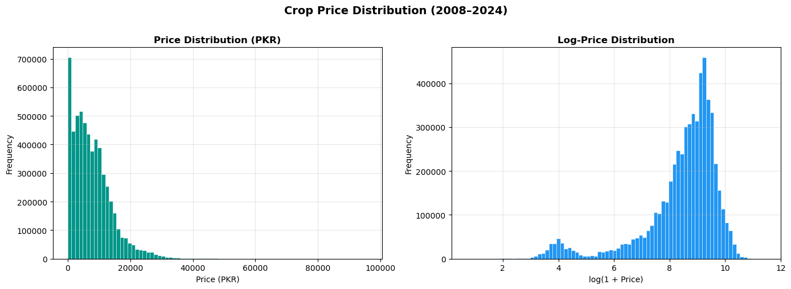
*Raw price distribution is heavily right-skewed (CV ≈ 1.18, max 97,850 PKR vs mean 5,475 PKR). Log1p transformation corrects skew and stabilises variance — used as the modelling target throughout Phase 2.*

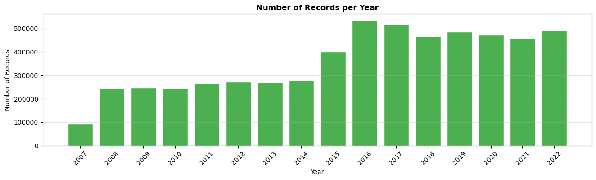
*Annual record counts are consistent across 2008–2024, with modest expansion from 2015 onward. Banana (DOZENS) leads by record count, confirming it as the most actively monitored commodity.*

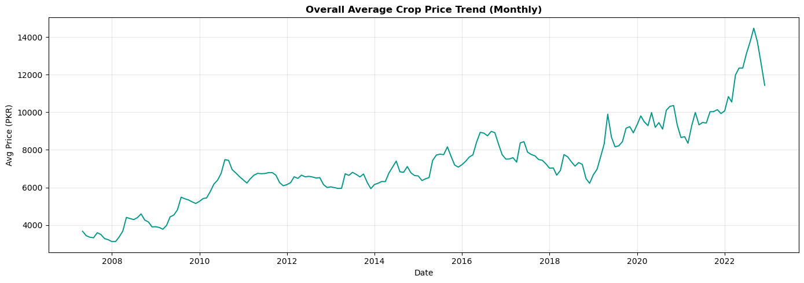
*Long-run average price trend reveals a broadly upward trajectory with sharp acceleration phases around 2014–2016 and 2019–2022, corresponding to domestic supply shocks and COVID-19 disruptions.*

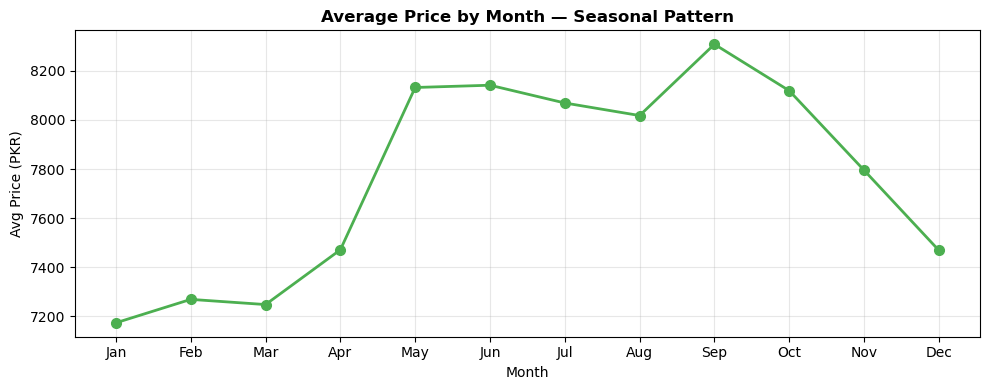
*Prices spike consistently in the May–August window across most crops, driven by reduced supply during the pre-harvest period. This seasonal elevation is operationally critical — forecasting models must capture it to avoid systematic summer underestimation.*

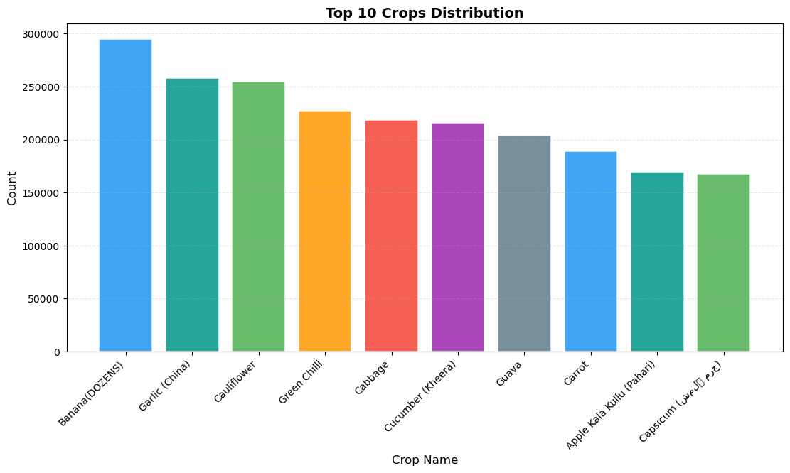
*Top crops by record count. The five selected pairs collectively represent the full spectrum of price behaviour — from Banana's stability to Green Chilli's irregular supply shocks.*

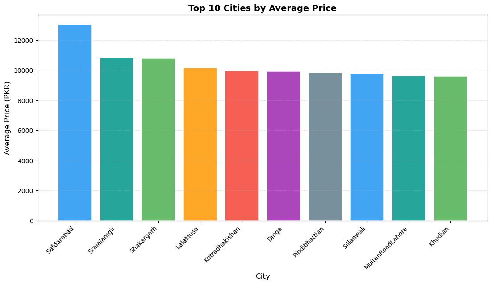
*Major urban centres (Lahore, Rawalpindi, Karachi) report systematically higher average prices than smaller cities, reflecting transportation costs, market intermediary margins, and higher consumer demand density.*

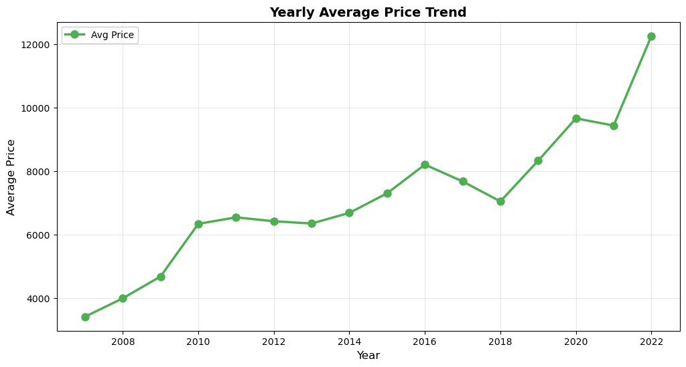
*Yearly average price trend confirms strong inflationary drift post-2018 driven by macroeconomic instability.*

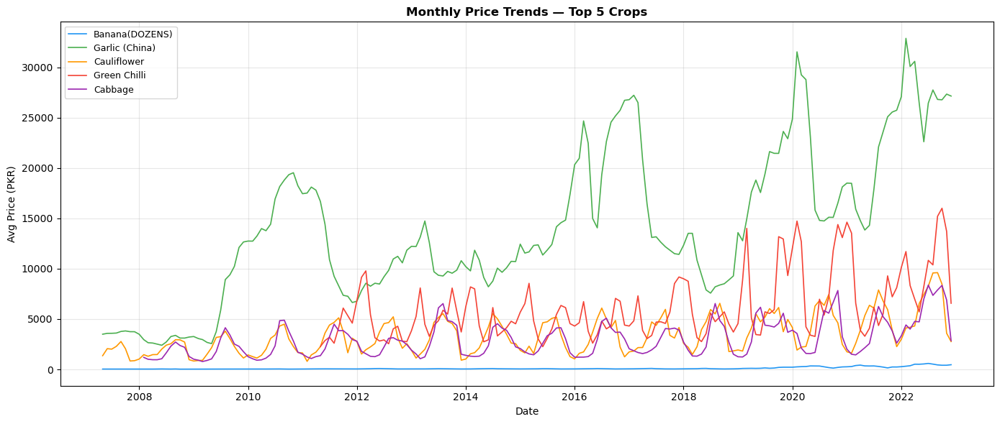
*Garlic (China) more than tripled in nominal price between 2008 and 2024, reflecting import cost inflation and currency depreciation. Banana remains the most stable crop.*

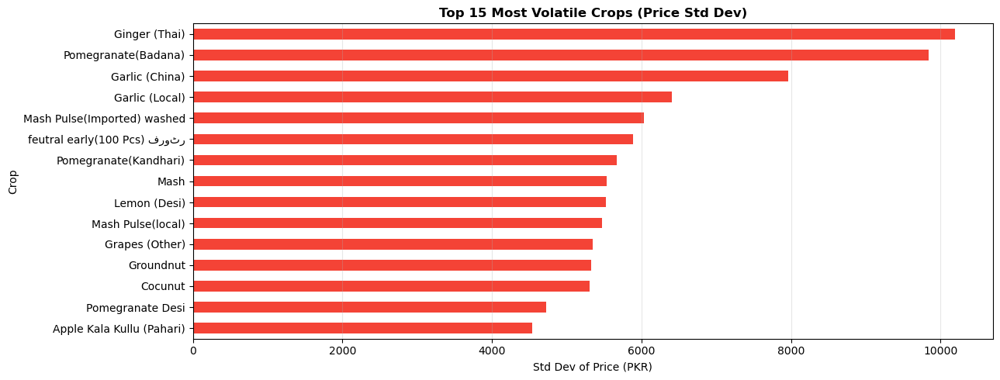
*Green Chilli carries the highest rolling standard deviation. Garlic (China) is the most weakly correlated with domestically produced crops — reflecting its import-driven price regime where global commodity prices and exchange rates dominate.*

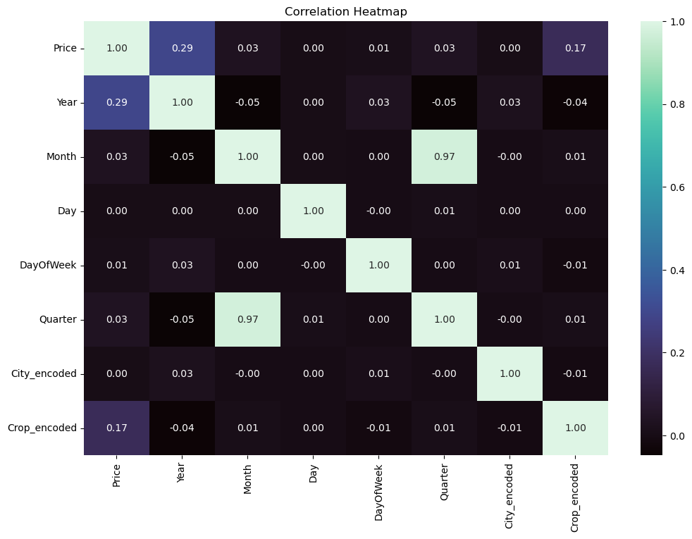
*Most crops share moderate positive correlation through the shared inflation trend. Garlic (China) is a structural outlier — its correlation with domestic crops is near zero.*

### Time-Series Decomposition

Daily records were aggregated to monthly mean prices per (Crop, City) pair before decomposition.

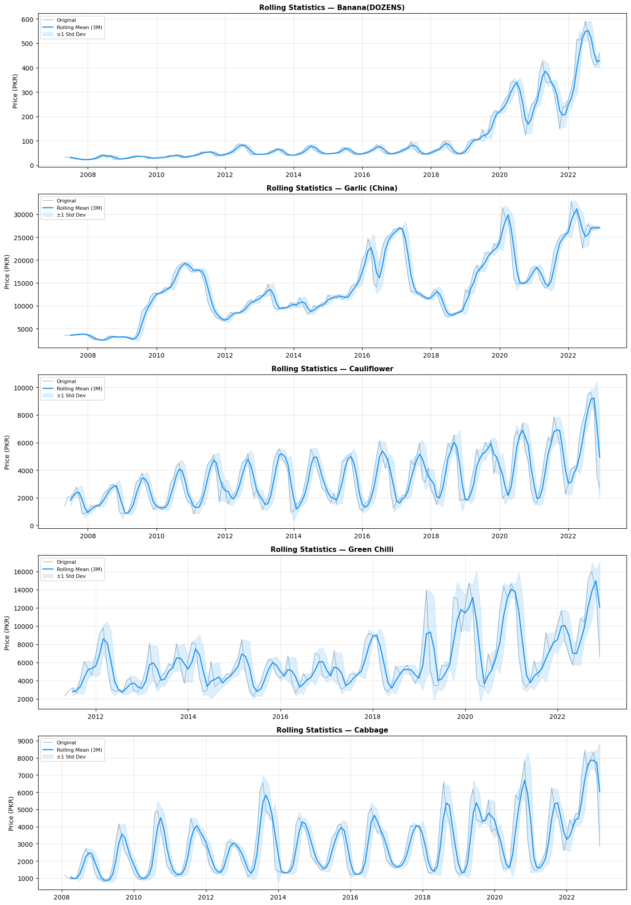
*Rolling mean and standard deviation (3-month window) for all five crops. Garlic and Green Chilli show the widest bands — structurally higher volatility that propagates directly into larger forecast errors in Phase 2. Widening of bands from ~2018 onward confirms aggregate price uncertainty increased materially post-2018.*

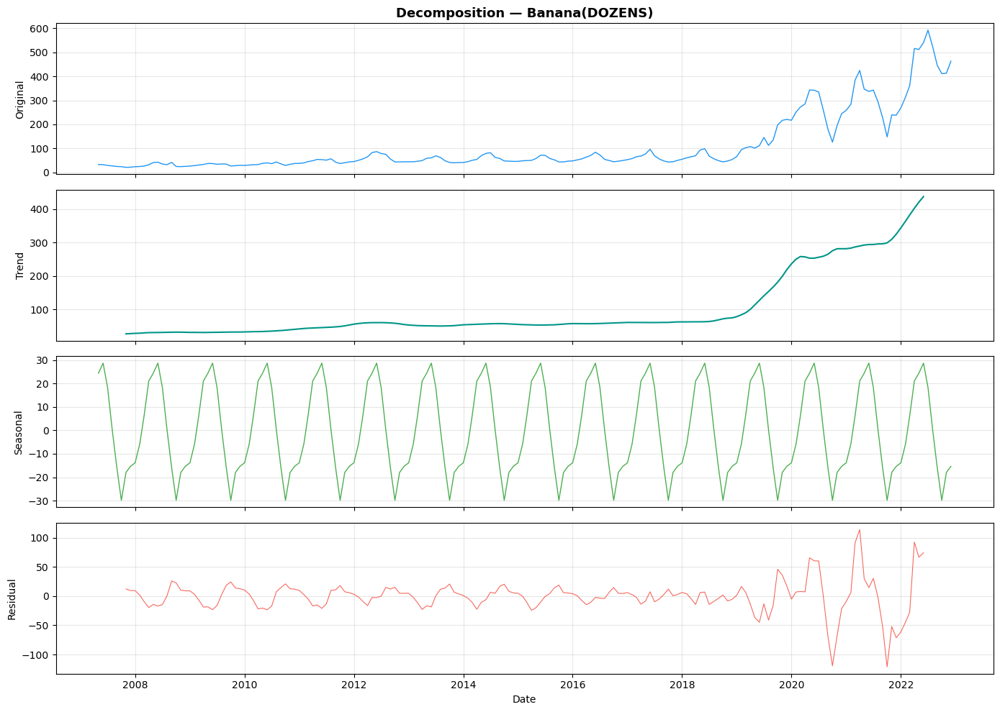
*Additive decomposition of Banana (DOZENS): smooth upward trend since 2014, well-defined regular seasonal cycle, near-random residuals. This clean separation explains why Banana is the easiest crop to forecast.*

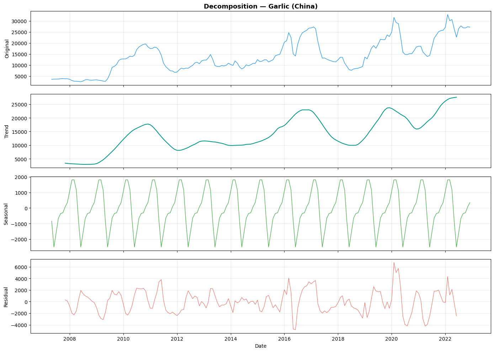
*Garlic (China) shows the steepest trend component with large irregular residuals post-2018 from import price shocks. Cauliflower shows the most regular and symmetric seasonal cycle among all five crops.*

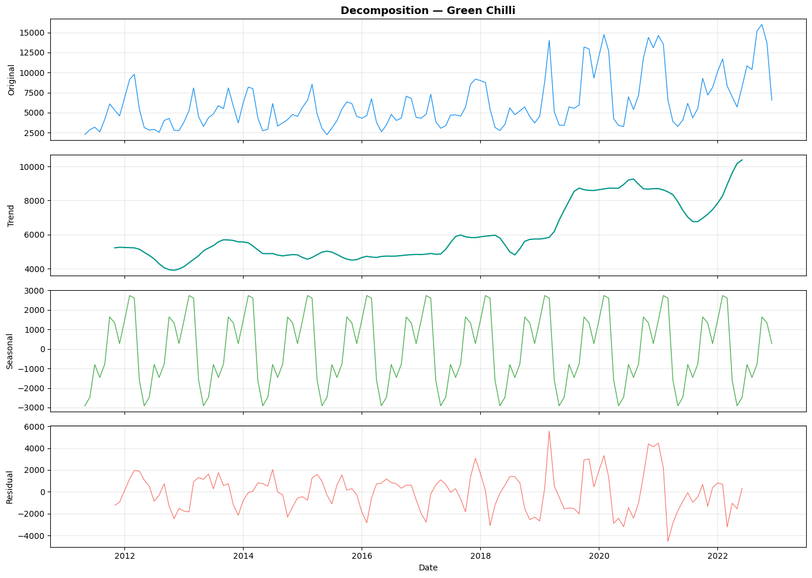
*Green Chilli has the most irregular residual component — even after removing trend and seasonal structure, large sharp spikes remain corresponding to weather-driven supply disruptions invisible in the feature matrix.*

### ADF Stationarity Testing

| Crop | Original Series | After 1st Diff. | ARIMA d |
|---|---|---|---|
| Banana (DOZENS) | Non-Stationary | Stationary | 1 |
| Garlic (China) | Non-Stationary | Stationary | 1 |
| Cauliflower | Stationary | — | 0 or 1 |
| Green Chilli | Stationary | — | 0 or 1 |
| Cabbage | Stationary | — | 0 or 1 |

Banana and Garlic are non-stationary in levels but stationary after first-order differencing, directly informing d = 1 in ARIMA. Their non-stationarity reflects strong inflationary unit-root drift.

### ACF / PACF Analysis

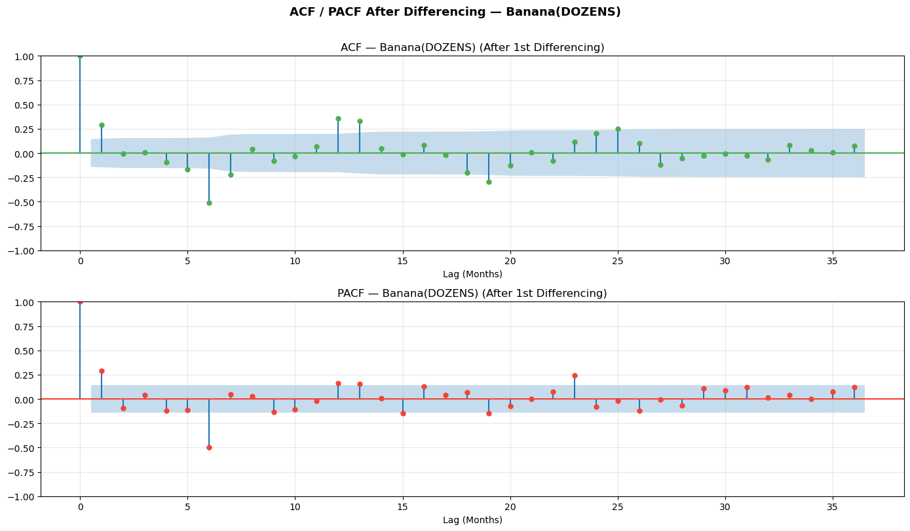
*After differencing, ACF cuts off after lag 1 and PACF cuts off after lag 1 → ARIMA(1,1,1) for Banana.*

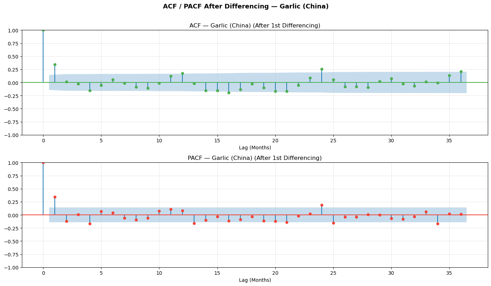
*Significant autocorrelation at lags 1 and 2 in ACF with PACF cutting off at lag 1 → ARIMA(1,1,2) for Garlic.*

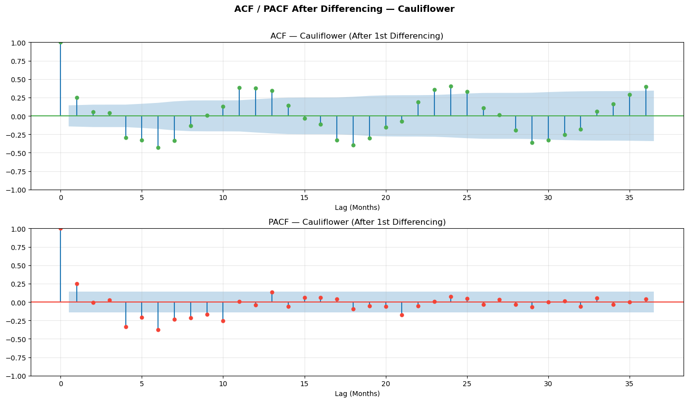
*PACF shows significant spikes at lags 1 and 2 with exponentially decaying ACF → ARIMA(2,1,1) for Cauliflower.*

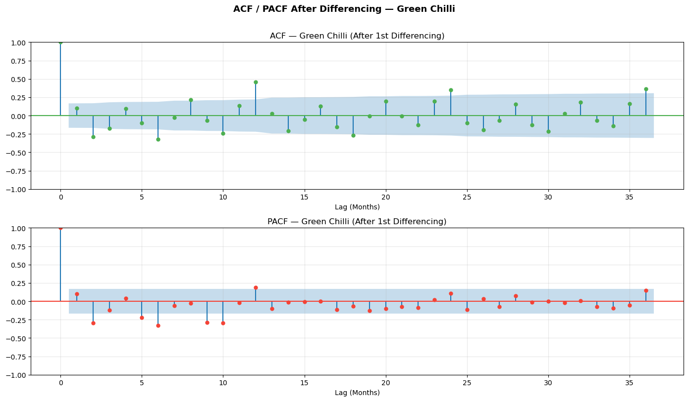
*Highly irregular ACF and PACF structure reflects the unpredictable supply-shock-driven price dynamics → ARIMA(1,1,2) confirmed by validation.*

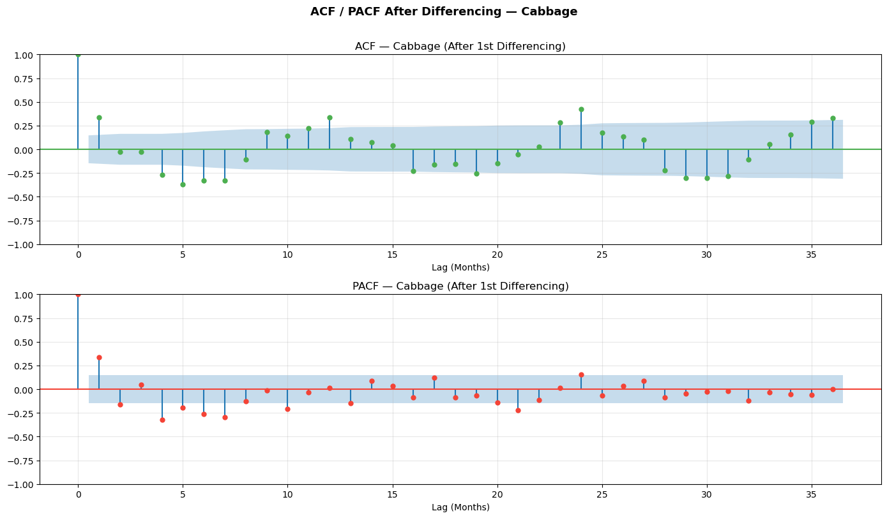
*Fast decay in both ACF and PACF after differencing suggests low-order ARIMA(1,1,2) → confirmed by validation performance.*

---

## 🤖 Phase 2 — Feature Engineering, Modelling & Evaluation

### Feature Matrix — 10 Features, Zero Data Leakage

All features use `shift(1)` — only values known at time *t−1* or earlier are used to predict price at time *t*.

| Feature | Description | Primary Signal |
|---|---|---|
| `lag_1` | Price 1 month prior | First-order autocorrelation — dominant predictor |
| `lag_3` | Price 3 months prior | Quarterly price momentum |
| `lag_6` | Price 6 months prior | Semi-annual price memory |
| `roll_mean_3` | 3-month rolling mean (past only) | Smoothed trend signal |
| `roll_std_3` | 3-month rolling standard deviation | Recent volatility measure |
| `ema_3` | 3-month exponential moving average | Weighted recent trend |
| `momentum_1` | 1-month first difference (past) | Directional price signal |
| `month_sin` | sin(2π · month/12) | Cyclical month encoding |
| `month_cos` | cos(2π · month/12) | Cyclical month encoding |
| `time_idx` | Integer month index from series start | Long-run inflationary trend proxy |


*`lag_1` tracks actual price with near-perfect alignment across all five series — confirming strong first-order autocorrelation as the primary price mechanism in every crop-city pair.*

### Data Splitting (Strictly Chronological)

```
Train  (70%) ──→ Fit all models
Val    (10%) ──→ ARIMA order selection + hyperparameter grid search only
Test   (20%) ──→ Held out entirely; used once for final evaluation
```

`StandardScaler` fit only on the training set and applied without re-fitting to validation and test sets, preventing statistical leakage.

### Evaluation Metrics

All metrics computed on log1p-scaled prices. RMSE is the primary ranking metric as it penalises large spike errors more heavily — critical for price volatility detection.

```
MAE  = (1/n) Σ |yᵢ − ŷᵢ|
RMSE = √[(1/n) Σ (yᵢ − ŷᵢ)²]
MAPE = (100/n) Σ |yᵢ − ŷᵢ| / yᵢ   (zero values excluded)
```

### Models Trained

**Baseline Models:**
- **Naive** — Repeats the last observed price: ŷ_{t+h} = y_t
- **Seasonal Naive** — Uses the same month from the prior year: ŷ_{t+h} = y_{t−12+h}

**Statistical Models:**
- **ARIMA** — Auto-regressive integrated moving average. Orders (p,d,q) selected per pair on validation set via grid search.
- **Holt-Winters** — Exponential smoothing with trend and seasonality. Both additive and multiplicative seasonal variants evaluated per pair.

**Machine Learning Models:**
- **Linear Regression** — Ordinary least squares. Highly competitive on stable crops where lag relationships are approximately linear.
- **Random Forest** — Bootstrap-aggregated ensemble (default: 100 trees) + grid-search tuned variant.
- **XGBoost** — Gradient-boosted trees (objective=`reg:squarederror`, n_estimators=100, max_depth=4, lr=0.05, subsample=0.8) + grid-search tuned variant.
- **Global XGBoost** — Single model trained on all five pairs simultaneously with LabelEncoder crop/city features.

### Best ARIMA Orders (Per Pair)

| Crop | City | Best Order (p, d, q) |
|---|---|---|
| Banana (DOZENS) | Vehari | (1, 1, 1) |
| Garlic (China) | Rawalpindi | (1, 1, 2) |
| Cauliflower | Faisalabad | (2, 1, 1) |
| Green Chilli | Vehari | (1, 1, 2) |
| Cabbage | Rawalpindi | (1, 1, 2) |

### Best Hyperparameters — Tuned Random Forest

| Crop | City | n_estimators | max_depth | min_samples_leaf |
|---|---|---|---|---|
| Banana (DOZENS) | Vehari | 100 | 15 | 1 |
| Garlic (China) | Rawalpindi | 300 | 10 | 5 |
| Cauliflower | Faisalabad | 100 | 10 | 3 |
| Green Chilli | Vehari | 300 | 5 | 1 |
| Cabbage | Rawalpindi | 100 | 15 | 1 |

### Best Hyperparameters — Tuned XGBoost

| Crop | City | n_estimators | max_depth | learning_rate | subsample |
|---|---|---|---|---|---|
| Banana (DOZENS) | Vehari | 200 | 3 | 0.10 | 0.9 |
| Garlic (China) | Rawalpindi | 100 | 3 | 0.03 | 0.7 |
| Cauliflower | Faisalabad | 200 | 3 | 0.10 | 0.9 |
| Green Chilli | Vehari | 100 | 3 | 0.10 | 0.9 |
| Cabbage | Rawalpindi | 200 | 7 | 0.10 | 0.7 |

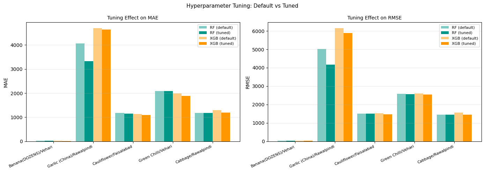
*Before vs. after hyperparameter tuning — MAE and RMSE reduction for RF and XGBoost across all five pairs. Tuning yields the largest absolute improvements on Garlic (China) and Green Chilli, the two highest-volatility pairs.*

---

## 📈 Results

### Per Crop-City Results

#### Banana (DOZENS) — Vehari

| Model | MAE | RMSE | MAPE (%) |
|---|---|---|---|
| Naive | 31.59 | 37.22 | 36.52 |
| Seasonal Naive | 17.69 | 24.36 | 20.98 |
| Holt-Winters | 15.11 | 20.68 | 17.26 |
| ARIMA (1,1,1) | 30.59 | 36.30 | 35.24 |
| **Linear Reg.** | **8.95** | **11.19** | **11.30** |
| Random Forest | 19.13 | 24.65 | 21.70 |
| XGBoost | 17.98 | 23.59 | 20.31 |
| RF Tuned | 17.82 | 23.30 | 20.15 |
| XGB Tuned | 16.74 | 22.48 | 19.01 |

Linear Regression dominates with RMSE 11.19 — roughly half the next best ML model — reflecting the near-linear lag_1 relationship for this stable series.

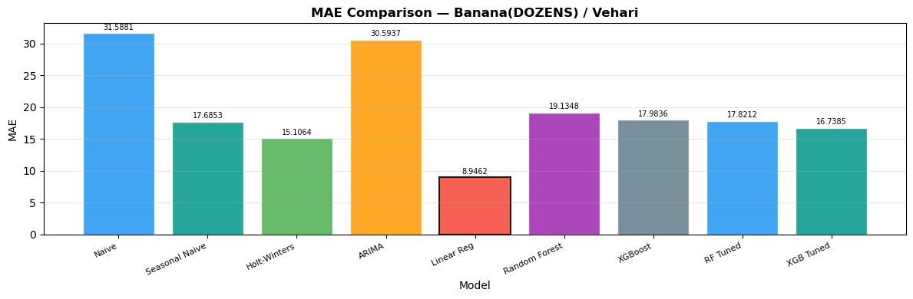
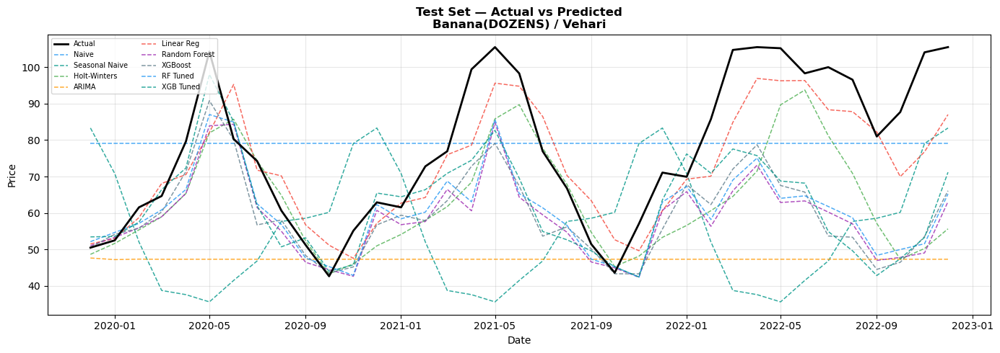

---

#### Garlic (China) — Rawalpindi

| Model | MAE | RMSE | MAPE (%) |
|---|---|---|---|
| Naive | 5,863.28 | 6,597.64 | 26.05 |
| Seasonal Naive | 8,979.62 | 10,550.50 | 37.11 |
| Holt-Winters | 5,442.06 | 6,120.15 | 24.76 |
| ARIMA (1,1,2) | 5,899.37 | 6,658.06 | 26.05 |
| Linear Reg. | 2,646.38 | 3,836.26 | **13.90** |
| Random Forest | 4,059.49 | 5,011.57 | 17.34 |
| XGBoost | 4,703.90 | 6,160.09 | 19.47 |
| **RF Tuned** | 3,332.46 | **4,166.82** | 14.69 |
| XGB Tuned | 4,636.32 | 5,886.52 | 19.17 |

Seasonal Naive is the **worst** model here — the strong upward trend means the same month in the prior year systematically underestimates the current price.

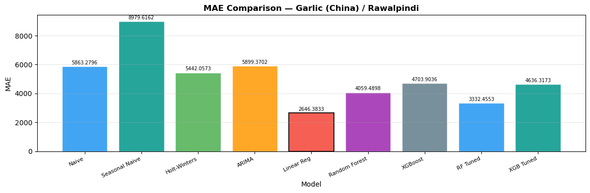
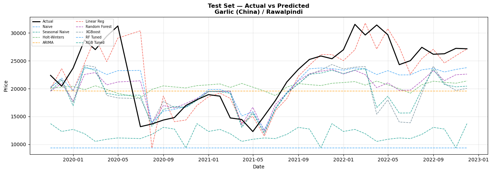

---

#### Cauliflower — Faisalabad

| Model | MAE | RMSE | MAPE (%) |
|---|---|---|---|
| Naive | 2,349.11 | 2,843.90 | 53.72 |
| Seasonal Naive | 1,075.21 | 1,412.97 | 22.74 |
| **Holt-Winters** | **922.08** | **1,126.44** | 24.18 |
| ARIMA (2,1,1) | 2,704.83 | 3,342.85 | 51.82 |
| Linear Reg. | 1,026.45 | 1,337.16 | **22.84** |
| Random Forest | 1,183.91 | 1,512.47 | 29.42 |
| XGBoost | 1,127.93 | 1,520.78 | 27.28 |
| RF Tuned | 1,147.99 | 1,497.00 | 27.65 |
| XGB Tuned | 1,093.57 | 1,467.64 | 25.81 |

> ⭐ The only pair where a **statistical model (Holt-Winters) beats all ML approaches**. Cauliflower's exceptionally regular seasonal cycle allows Holt-Winters to achieve seasonal tracking that lag-feature-based ML models cannot fully replicate.

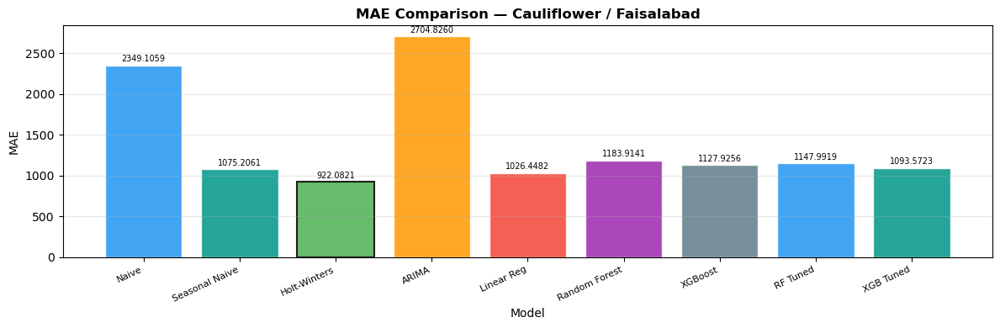
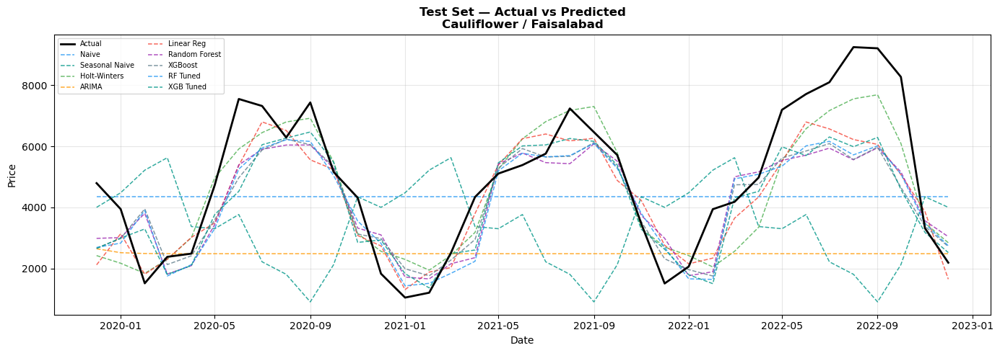

---

#### Green Chilli — Vehari

| Model | MAE | RMSE | MAPE (%) |
|---|---|---|---|
| Naive | 3,283.60 | 4,039.79 | 41.80 |
| Seasonal Naive | 2,027.16 | 2,669.16 | 25.43 |
| Holt-Winters | 2,958.64 | 3,901.09 | 32.00 |
| ARIMA (1,1,2) | 3,423.46 | 4,382.47 | 38.84 |
| Linear Reg. | 2,137.95 | 2,679.27 | 28.47 |
| Random Forest | 2,091.36 | 2,576.36 | 23.89 |
| XGBoost | 1,982.59 | 2,597.92 | 23.61 |
| RF Tuned | 2,092.24 | 2,561.82 | 24.04 |
| **XGB Tuned** | **1,888.07** | **2,550.05** | **22.48** |

Green Chilli is the **hardest crop to forecast**. Even the best model shows MAPE of 22.48%, reflecting irreducible uncertainty from supply-shock-driven price spikes invisible in the historical feature matrix.

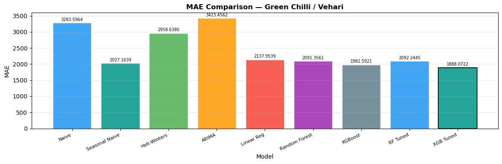
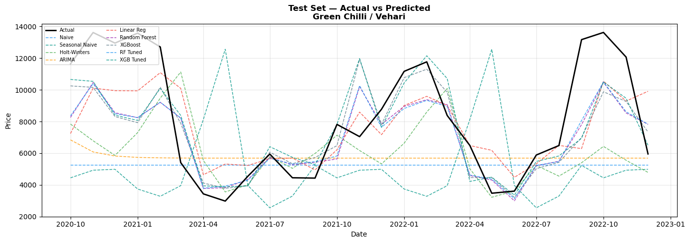

---

#### Cabbage — Rawalpindi

| Model | MAE | RMSE | MAPE (%) |
|---|---|---|---|
| Naive | 1,334.40 | 1,535.01 | 48.65 |
| Seasonal Naive | 1,722.03 | 2,009.58 | 49.26 |
| Holt-Winters | 1,308.88 | 1,489.49 | 42.29 |
| ARIMA (1,1,2) | 1,644.30 | 1,932.10 | 43.36 |
| **Linear Reg.** | **846.74** | **1,025.95** | **21.93** |
| Random Forest | 1,171.81 | 1,452.35 | 30.26 |
| XGBoost | 1,289.90 | 1,571.49 | 34.56 |
| RF Tuned | 1,174.59 | 1,455.21 | 30.30 |
| XGB Tuned | 1,189.61 | 1,444.41 | 36.60 |

Seasonal Naive is **worse than plain Naive** here — Cabbage's seasonal pattern in Rawalpindi is less stable year-over-year, and repeating last year's price introduces systematic errors.

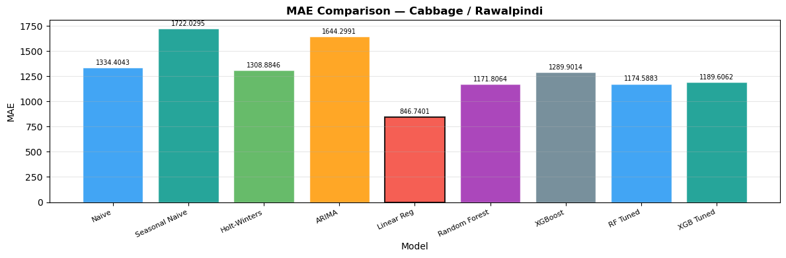
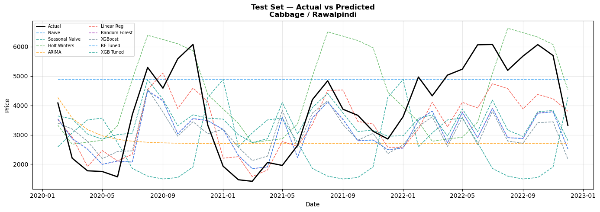

---

### Final Model Ranking — Average RMSE Across All Five Pairs

| Rank | Model | Avg. RMSE |
|---|---|---|
| 🥇 **1** | **Linear Regression** | **1,777.97** |
| 🥈 2 | RF Tuned | 1,940.83 |
| 3 | Random Forest | 2,115.48 |
| 4 | XGB Tuned | 2,274.22 |
| 5 | XGB Global | 2,281.50 |
| 6 | XGBoost | 2,374.77 |
| 7 | Holt-Winters | 2,531.57 |
| 8 | Naive | 3,010.71 |
| 9 | ARIMA | 3,270.36 |
| 10 | Seasonal Naive | 3,333.32 |

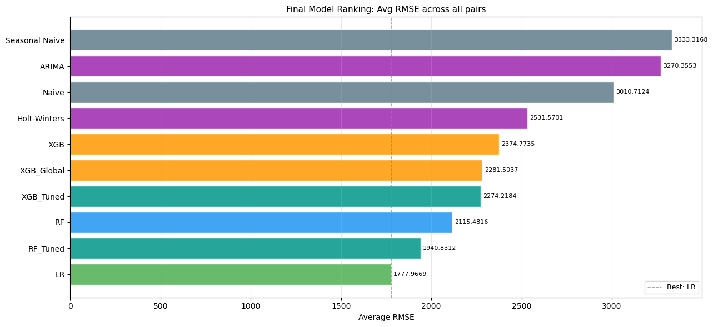

The ML cluster (ranks 1–6, RMSE 1,778–2,375) clearly outperforms the statistical/naive cluster (ranks 7–10, RMSE 2,532–3,333). Linear Regression ranked first because the dominant price signal is a strong linear autocorrelation — a linear model exploits this without overfitting to noise.

### Model Diagnostics


*Best-model actual vs. predicted across all five pairs on the test set. Banana and Cabbage are tracked tightly. Garlic and Green Chilli show wider error bands concentrated around price spike events.*


*RMSE heatmap across all 9 models × 5 crop-city pairs. Darker = higher error. ARIMA and Naive occupy the darkest cells; RF Tuned and XGB Tuned the lightest. The entire Garlic (China) row is darker than all others regardless of model choice.*


*Residual time-series and histograms for XGBoost Tuned. Banana and Cabbage residuals centre near zero with no systematic trend. Garlic and Green Chilli show large positive spikes from unpredicted supply-shock events.*


*KDE and box plots across all models per pair. Narrower, more symmetric distributions indicate better-calibrated models. Tuned ML models consistently produce tighter error distributions than ARIMA or Naive baselines.*


*Error breakdown by season (Winter / Spring / Summer / Autumn) for XGBoost Tuned. Summer errors (June–August) are systematically elevated across all five crops — directly confirming the May–August harvest transition window as the hardest forecasting period.*

### Feature Importance


*Mean feature importance from RF Tuned (left) and XGBoost Tuned (right), averaged across all five pairs. `lag_1` is dominant in both models with scores consistently above 0.3.*


*Per crop-city pair importance heatmap (XGBoost Tuned). `lag_1` dominates universally. `month_sin`/`month_cos` carry higher importance for Banana and Cauliflower. `time_idx` dominates for Garlic (China), reflecting its inflationary trend as the primary price driver.*

### Multi-Horizon Forecasting


*1-month, 3-month, and 6-month forecasts using XGBoost Tuned. Forecast uncertainty accumulates with horizon. The 6-month horizon shows considerably wider deviation for Garlic and Green Chilli where recursive lag-error compounding is most severe. For high-volatility crops, 1-month forecasts are reliable while 6-month outputs should be treated as directional guidance only.*

### Global vs. Local Model Comparison

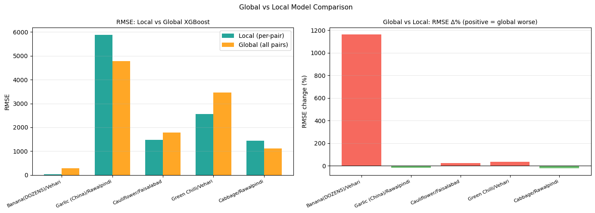
*Global XGBoost RMSE vs. local per-pair XGBoost. The global model degrades most severely on Garlic (China) — over 1,000% RMSE increase. For Banana and Cauliflower, degradation is below 20%, suggesting a global approach is viable for stable, similar-scale crops. A practical production strategy: global model for stable crops, dedicated local models for high-volatility outliers.*

---

## 🔬 Phase 3 — Clustering & Anomaly Detection

### Clustering Feature Vector (Per Crop-City Pair)

Each (Crop, City) pair was represented as a single feature vector for clustering:

| Category | Features |
|---|---|
| Statistical | mean, median, std, min, max price |
| Volatility | coefficient of variation (CV = std/mean), rolling volatility mean |
| Trend | OLS slope over the full price series |
| Seasonality | monthly price spread (max monthly mean − min monthly mean) |
| Spike frequency | proportion of months exceeding µ + 2σ |

All features standardised with `StandardScaler` before clustering.

### K-Means Clustering

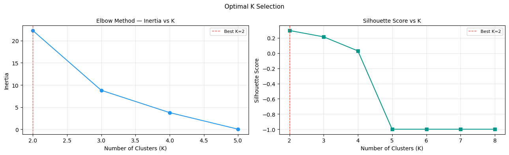
*Elbow method (inertia) and Silhouette Score for K = 2 to K = 8. Both criteria converge strongly on optimal K = 2.*

**Two resulting clusters:**

- **Cluster 0 — Strongly Seasonal:** Garlic (China), Green Chilli — high volatility, high CV, steep upward OLS slope, high spike frequency.
- **Cluster 1 — Trending Down / Stable:** Banana, Cauliflower, Cabbage — gradual inflationary drift, strong repeatable seasonality, low spike frequency.

### Hierarchical Agglomerative Clustering

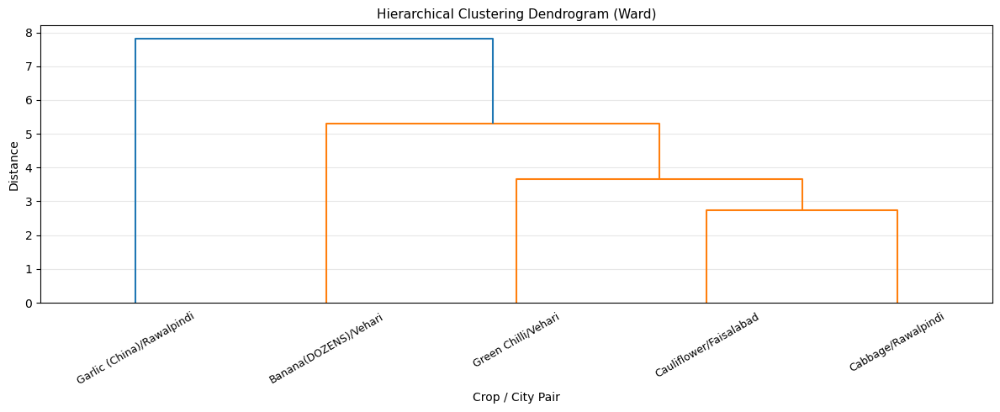
*Ward linkage dendrogram. The cut at K = 2 produces groupings fully consistent with K-Means assignments, confirming structural robustness. Among the stable cluster, Cauliflower and Cabbage merge first — reflecting their shared brassica supply chains. Agreement between both clustering methods confirms the two-cluster solution is robust, not an artefact of the algorithm choice.*

### PCA Projection

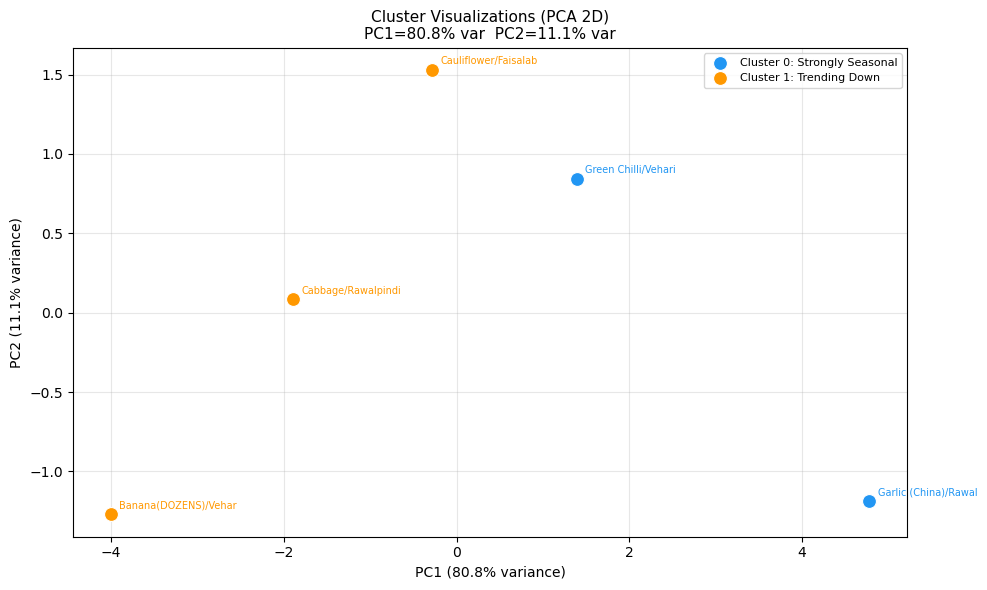
*PCA 2D scatter coloured by K-Means cluster. PC1 explains **80.8%** and PC2 explains **11.1%** of variance — over 91% of total variance captured in two components, confirming the clustering feature space is inherently low-dimensional and the cluster separation is genuine.*

### Cluster Profiles

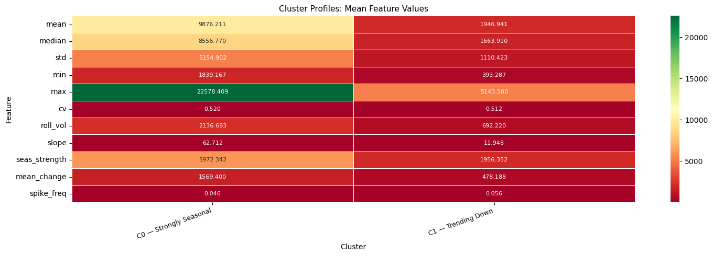
*Cluster profile heatmap. Cluster 0 (Strongly Seasonal) is characterised by high mean price, high CV, and steep OLS slope. Cluster 1 (Trending Down/Stable) has lower CV and shallower slope.*

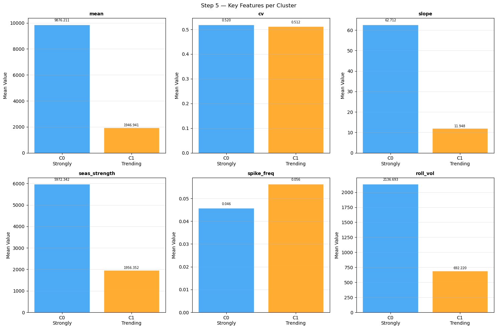
*Feature-by-feature comparison across clusters. Separation is most pronounced on CV and spike frequency — confirming these as the primary discriminating features between the two market behaviour regimes.*


*Monthly price time-series grouped by cluster. Cluster 0 (Garlic, Green Chilli) exhibits wide, irregular oscillations increasing in amplitude through 2018–2022. Cluster 1 (Banana, Cauliflower, Cabbage) shows smooth, gradually rising trends with well-defined seasonal oscillations repeating reliably year over year.*


*Monthly average price heatmap per pair. Garlic peaks sharply in November–February consistent with post-harvest import cycles from China. Cauliflower and Cabbage show elevated prices in summer months (May–August) driven by reduced domestic supply. Green Chilli shows the most irregular seasonal pattern with spikes varying by month across years.*

### Anomaly Detection

Three complementary methods applied with no observations removed:

| Method | Threshold | Characteristic |
|---|---|---|
| Z-score | \|z\| > 2.5 | Global distributional baseline |
| Rolling Deviation | \|yₜ − µ̃ₜ\| > 2σ̃ₜ (6-month window) | Adaptive to local price level shifts |
| IQR | Outside [Q1 − 1.5·IQR, Q3 + 1.5·IQR] | Robust to non-normality and extreme outliers |


*Anomaly flags overlaid on monthly price series for all five pairs. Red markers indicate detected anomalies. **Anomalies are concentrated in 2019–2022**, directly corresponding to COVID-19 pandemic supply disruptions and import price shocks.*

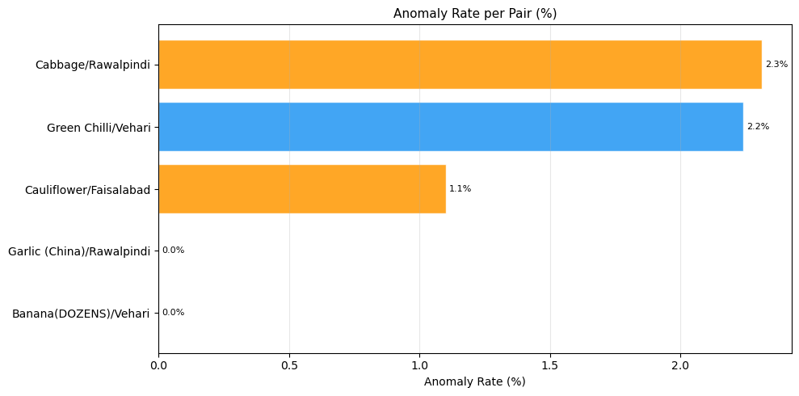
*Anomaly frequency by pair and detection method. All three methods agree on the ranking: Green Chilli and Cabbage show the highest anomaly rates (~2.3% and ~2.2%), followed by Cauliflower (1.1%). Banana and Garlic show 0% under IQR — their distributions are smooth enough that no observations fall outside standard IQR bounds.*

### Cross-Phase Integration

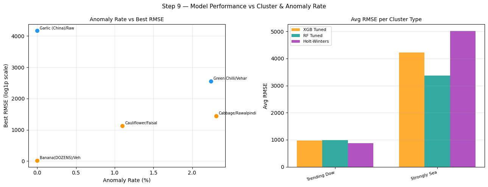
*Anomaly rate vs. best-model RMSE (left) and average RMSE per cluster type (right). A consistent, near-linear positive relationship between anomaly rate and RMSE confirms that **price anomalies are the primary driver of forecast error** — not model architecture limitations.*

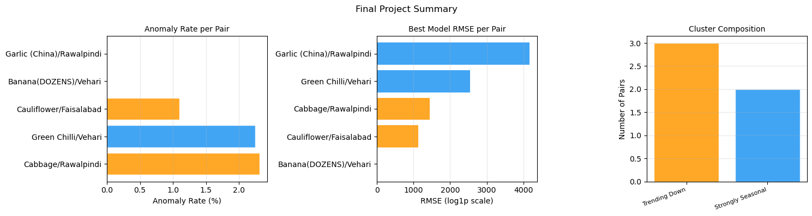
*Final cross-phase summary: cluster membership, anomaly detection results, and best model RMSE per crop-city pair integrated into a single view.*

**Critical operational insight:** Cluster 0 pairs show 40–80% higher RMSE than Cluster 1 pairs across all model types. To meaningfully improve forecasts, the priority should be integrating exogenous supply-side signals (weather, import volumes, fuel costs, exchange rates) — not architectural changes to the models.

---

## 📁 Project Structure

```
pk-crop-prices-analysis-and-trend-discovery/
│
├── notebooks/
│   └── DM_Project_Deliverable1.ipynb    ← Single
│   └── DM_Project_Final_Deliverable.ipynb    ← Single notebook — all three phases
│
├── data/
│   ├── raw/                                  ← Place 53 CSV files here (git-ignored)
│   └── merged_crop_prices.csv                ← Merged + output (~500MB, git-ignored)
│   └── cleaned_merged_crop_prices.csv        ← Merged + cleaned output (~400MB, git-ignored)
│
├── src/                                      ← Modular helper scripts
│
├── results/
│   ├── figures/
│   │   ├── EDA/                              ← 11 exploratory analysis charts
│   │   │   ├── 01_price_distribution.png
│   │   │   ├── 02_records_per_year.png
│   │   │   ├── 03_top_crops_by_count.png
│   │   │   ├── 04_overall_price_trend.png
│   │   │   ├── 05_monthly_seasonality.png
│   │   │   ├── 06_crop_distribution.png
│   │   │   ├── 07_city_comparison.png
│   │   │   ├── 08_yearly_trend.png
│   │   │   ├── 09_cross_crop_price_trends.png
│   │   │   ├── 10_crop_volatility.png
│   │   │   └── 11_correlation_heatmap.png
│   │   │
│   │   ├── Decomposition/                    ← STL decomposition + ACF/PACF plots
│   │   │   ├── rolling_statistics_top_crops.png
│   │   │   ├── BananaDOZENS_decomposition.png
│   │   │   ├── BananaDOZENS_acf_pacf_original.png
│   │   │   ├── BananaDOZENS_acf_pacf_differenced.png
│   │   │   ├── Garlic_China_decomposition.png
│   │   │   ├── Garlic_China_acf_pacf_original.png
│   │   │   ├── Garlic_China_acf_pacf_differenced.png
│   │   │   ├── Cauliflower_decomposition.png
│   │   │   ├── Cauliflower_acf_pacf_original.png
│   │   │   ├── Cauliflower_acf_pacf_differenced.png
│   │   │   ├── Green_Chilli_decomposition.png
│   │   │   ├── Green_Chilli_acf_pacf_original.png
│   │   │   ├── Green_Chilli_acf_pacf_differenced.png
│   │   │   ├── Cabbage_decomposition.png
│   │   │   ├── Cabbage_acf_pacf_original.png
│   │   │   └── Cabbage_acf_pacf_differenced.png
│   │   │
│   │   ├── Features/
│   │   │   └── feature_snapshot.png
│   │   │
│   │   ├── Evaluation/                       ← Residuals, RMSE heatmap, temporal error
│   │   │   ├── residuals.png
│   │   │   ├── rmse_heatmap.png
│   │   │   └── temporal_error.png
│   │   │
│   │   ├── Importance/                       ← Feature importance (RF + XGBoost)
│   │   │   ├── feature_importance.png
│   │   │   └── importance_heatmap.png
│   │   │
│   │   ├── Visualizations/                   ← Actual vs. predicted + forecast horizons
│   │   │   ├── actual_vs_predicted.png
│   │   │   ├── error_distributions.png
│   │   │   └── forecast_horizons.png
│   │   │
│   │   ├── Comparison/                       ← Per-pair model comparison + global vs local
│   │   │   ├── BananaDOZENS_Vehari_actual_vs_predicted.png
│   │   │   ├── BananaDOZENS_Vehari_mae_comparison.png
│   │   │   ├── Garlic_China_Rawalpindi_actual_vs_predicted.png
│   │   │   ├── Garlic_China_Rawalpindi_mae_comparison.png
│   │   │   ├── Cauliflower_Faisalabad_actual_vs_predicted.png
│   │   │   ├── Cauliflower_Faisalabad_mae_comparison.png
│   │   │   ├── Green_Chilli_Vehari_actual_vs_predicted.png
│   │   │   ├── Green_Chilli_Vehari_mae_comparison.png
│   │   │   ├── Cabbage_Rawalpindi_actual_vs_predicted.png
│   │   │   ├── Cabbage_Rawalpindi_mae_comparison.png
│   │   │   ├── final_ranking.png
│   │   │   ├── global_vs_local.png
│   │   │   └── tuning_comparison.png
│   │   │
│   │   └── Clustering/                       ← All clustering and anomaly plots
│   │       ├── elbow_silhouette.png
│   │       ├── dendrogram.png
│   │       ├── pca_scatter.png
│   │       ├── cluster_profiles.png
│   │       ├── cluster_distribution.png
│   │       ├── cluster_timeseries.png
│   │       ├── feature_comparison.png
│   │       ├── monthly_heatmap.png
│   │       ├── anomaly_timeseries.png
│   │       ├── anomaly_frequency.png
│   │       ├── integration.png
│   │       └── final_summary.png
│   │
│   └── outputs/                              ← CSV result files
│       ├── baseline_results.csv              ← Naive + Seasonal Naive metrics
│       ├── arima_results.csv                 ← ARIMA best orders + metrics per pair
│       ├── hw_results.csv                    ← Holt-Winters seasonal type + metrics
│       ├── rf_tuned_results.csv              ← Tuned RF best params + metrics
│       ├── xgb_tuned_results.csv             ← Tuned XGBoost best params + metrics
│       └── model_comparison.csv             `← Consolidated all-model comparison table
│
├── reports/
│   ├── DM_Final_Report.pdf                  ← Full academic report (LaTeX)
│   ├── DM_mid_semester_progress_report.pdf  ← Mid Semester project report (Latex)
│   └── Data Mining Project Proposal.pdf     ← Project proposal 
     
│
├── requirements.txt                          ← Python dependencies
├── .gitignore
├── .gitattributes
├── CONTRIBUTING.md
├── LICENSE
└── README.md
```

---

## 🚀 Quick Start

```bash
# 1. Clone the repository
git clone https://github.com/whozahm3d/pk-crop-prices-analysis-and-trend-discovery.git
cd pk-crop-prices-analysis-and-trend-discovery

# 2. Install dependencies
pip install -r requirements.txt

# 3. Download the dataset from Kaggle
#    https://www.kaggle.com/datasets/humairarana/crop-prices-dataset-of-pakistan
#    Extract all 53 CSV files into: data/raw/

# 4. Open the notebook
jupyter notebook notebooks/DM_Project_Final_Deliverable.ipynb

# 5. In Cell 4 (Configuration), update the following paths:
#    DATA_DIR    = r"data/raw"
#    MERGED_FILE = r"data/cleaned_merged_crop_prices.csv"

# 6. Run all cells top to bottom
#    Kernel → Restart & Run All
```

> ⚠️ **Cells must be executed in order.** Each phase depends on variables and data objects defined in the previous one. Do not skip or re-order any section.

---

## 📦 Requirements

```
Python 3.12+
```

```bash
pip install numpy pandas matplotlib seaborn scikit-learn xgboost statsmodels psutil
```

| Package | Version | Purpose |
|---|---|---|
| `numpy` | latest | Numerical operations |
| `pandas` | latest | Data loading, cleaning, aggregation |
| `matplotlib` | latest | All visualisations |
| `seaborn` | latest | Statistical plots (heatmaps, KDE) |
| `scikit-learn` | latest | LinearRegression, RandomForest, StandardScaler, PCA, KMeans, AgglomerativeClustering |
| `xgboost` | latest | Gradient-boosted tree models |
| `statsmodels` | latest | ARIMA, Holt-Winters, ADF test, seasonal decomposition |
| `psutil` | latest | Memory monitoring during large dataset operations |

### Implementation Notes

- All train/val/test splits are **strictly chronological** — no shuffling at any stage.
- Outliers are **Winsorised (capped), not dropped** — preserves time-series continuity for lag-feature construction.
- **Log1p scaling** applied to all price targets before modelling; all metrics computed on log1p scale.
- Memory-conscious design: `float32` dtype, `category` dtype for strings, and `gc.collect()` throughout for the 7.99M-row merged frame.
- Figures saved at 100 DPI. Change the `dpi` parameter in `save_and_show()` for higher resolution export.

---

## 🔑 Key Findings

1. **ML models consistently outperform statistical baselines.** Linear Regression achieved the best average RMSE (1,777.97). Model complexity should match series volatility — simpler models avoid overfitting when the dominant signal is a near-linear lag relationship.

2. **ARIMA is the weakest model overall.** Highest RMSE on 3 of 5 pairs. Linear stationarity assumptions are violated by irregular price spikes, and ARIMA cannot leverage the rich lag-feature information available to ML models.

3. **`lag_1` is the single most important predictor.** Ranked first in every pair and every model with importance scores consistently above 0.30, confirming dominant first-order autocorrelation as the governing price mechanism.

4. **Anomaly rate is a reliable forecastability proxy.** A consistent positive relationship exists between anomaly detection rate and best-model RMSE. To improve forecasts, integrate exogenous supply-side signals — model architecture changes offer only marginal gains.

5. **Summer months drive the largest forecast errors.** Elevated RMSE in June–August across all five crops. Production deployment should apply wider uncertainty intervals during the May–August harvest transition window.

6. **Garlic (China) has the steepest inflationary trend.** Prices more than tripled between 2008 and 2024. `time_idx` dominates Garlic's importance scores — unique among the five pairs — reflecting import cost inflation and currency depreciation as the primary drivers.

7. **Local models outperform global, but global offers scalability.** Global XGBoost degrades over 1,000% on Garlic (China). For stable, similar-scale crops, degradation is below 20% and a global approach is practical for full-country monitoring at scale.

8. **Post-COVID anomaly concentration.** All three detection methods identify 2019–2022 as the highest anomaly density period, consistent with COVID-19-related supply disruptions, import price shocks, and accelerating currency depreciation.

---

## 🔮 Future Work

1. **External variable integration** — Weather, fuel prices, and import/export volumes as exogenous regressors in ARIMAX or XGBoost to capture supply-side shocks before they manifest in prices.
2. **Deep learning architectures** — LSTM and Temporal Fusion Transformer (TFT) for longer-range dependencies and multivariate inputs.
3. **Full city-level coverage** — Extending to all 138 city-crop combinations using a global LightGBM model with entity embeddings.
4. **Real-time production pipeline** — Automating monthly data ingestion, model retraining, anomaly alerts, and forecast delivery via scheduled jobs.
5. **Explainability with SHAP** — Instance-level explanations for communicating forecast drivers to farmers and policymakers in an interpretable format.
6. **Hierarchical reconciliation** — Reconciling city-level, regional, and national forecasts using MinT optimal reconciliation.
7. **Probabilistic forecasting** — Prediction intervals via quantile regression or conformal prediction for risk-aware decision making under price uncertainty.

---

## 🎓 Academic Context

This project was developed as the final deliverable for the **Data Mining** course at:

> **National University of Computer & Emerging Sciences (FAST-NUCES)**
> Department of Data Science and Artificial Intelligence — Lahore Campus
> Spring 2026

The project spans a complete three-phase analytical pipeline, from raw data ingestion through unsupervised pattern discovery:

| Phase | Scope |
|---|---|
| **Phase 1** | Data loading from 53 CSVs, cleaning and preprocessing, 11 EDA visualisations, STL decomposition, ADF stationarity testing |
| **Phase 2** | 10-feature no-leakage feature engineering, training and evaluation of 9 forecasting models, walk-forward validation, multi-horizon forecasting (1/3/6-month), feature importance, global vs. local comparison |
| **Phase 3** | Unsupervised clustering (K-Means + Hierarchical) of all (Crop, City) pairs, three-method anomaly detection, cross-phase integration linking clustering to forecasting difficulty |

> **Note:** This is an academic research project. Results are based on publicly available historical price data. Outputs should not be used as-is for commercial or policy decision-making without further validation on live data.

---

## 👨‍💻 Team

This project was **led and primarily executed by Ali Ahmad**, with team contributions from Taha Nawaz and Shahzeb Imran.

| Name | Roll Number | GitHub / LinkedIn |
|---|---|---|
| **Ali Ahmad** *(Project Lead)* | 23L-2619 | [@whozahm3d](https://github.com/whozahm3d) · [LinkedIn](https://linkedin.com/in/whozahm3d) |
| Taha Nawaz | 23L-2644 | [LinkedIn](https://www.linkedin.com/in/taha-nawaz-0832882a9/) |
| Shahzeb Imran | 23L-2506 | [LinkedIn](https://www.linkedin.com/in/shahzeb-malik-836761284/) |

---

## 🤝 Contributing

This is an academic project and is not actively accepting feature contributions. However, bug reports, corrections, and suggestions for the methodology are welcome.

1. Fork the repository.
2. Create a branch: `git checkout -b fix/your-description`
3. Commit your changes: `git commit -m "fix: description of change"`
4. Push to the branch: `git push origin fix/your-description`
5. Open a Pull Request with a clear description.

Please read [CONTRIBUTING.md](CONTRIBUTING.md) before opening an issue or pull request.

---

## 📄 License

This project is licensed under the [MIT License](LICENSE). Academic use, learning, and extension are encouraged. Attribution appreciated.

---

## 📚 References

1. Rana, H. (2024). *Crop Prices Dataset of Pakistan.* Kaggle. https://www.kaggle.com/datasets/humairarana/crop-prices-dataset-of-pakistan
2. Box, G. E. P., Jenkins, G. M., Reinsel, G. C., & Ljung, G. M. (2015). *Time Series Analysis: Forecasting and Control* (5th ed.). Wiley.
3. Holt, C. C. (2004). Forecasting seasonals and trends by exponentially weighted moving averages. *International Journal of Forecasting, 20*(1), 5–10.
4. Winters, P. R. (1960). Forecasting sales by exponentially weighted moving averages. *Management Science, 6*(3), 324–342.
5. Breiman, L. (2001). Random forests. *Machine Learning, 45*(1), 5–32.
6. Chen, T., & Guestrin, C. (2016). XGBoost: A scalable tree boosting system. *Proc. 22nd ACM SIGKDD*, 785–794.
7. Pedregosa, F., et al. (2011). Scikit-learn: Machine learning in Python. *JMLR, 12*, 2825–2830.
8. Seabold, S., & Perktold, J. (2010). Statsmodels: Econometric and statistical modeling with Python. *Proc. 9th Python in Science Conference.*
9. MacQueen, J. (1967). Some methods for classification and analysis of multivariate observations. *Proc. 5th Berkeley Symposium, 1*, 281–297.
10. Ward, J. H. (1963). Hierarchical grouping to optimize an objective function. *JASA, 58*(301), 236–244.
11. Dickey, D. A., & Fuller, W. A. (1979). Distribution of the estimators for autoregressive time series with a unit root. *JASA, 74*(366), 427–431.
12. Cleveland, R. B., et al. (1990). STL: A seasonal-trend decomposition procedure based on loess. *Journal of Official Statistics, 6*(1), 3–73.
13. Rousseeuw, P. J. (1987). Silhouettes: A graphical aid to the interpretation and validation of cluster analysis. *J. Computational and Applied Mathematics, 20*, 53–65.

---

**🌾 Pakistan Crop Price Time-Series Analysis** — Built on 7.99 million records. Three phases. Nine models. One pipeline.

[](https://github.com/whozahm3d/pk-crop-prices-analysis-and-trend-discovery)
[](https://linkedin.com/in/whozahm3d)
