# 🌾 Time-Series Analysis & Trend Discovery in Pakistan's Crop Prices

<div align="center">


**An end-to-end data mining pipeline for agricultural price forecasting, trend decomposition, and market anomaly detection across Pakistan's commodity markets (2008–2024).**

[Dataset](#-dataset) · [Methodology](#-methodology) · [Results](#-results--key-findings) · [How to Run](#-how-to-run) · [Reports](#-reports)

</div>

---

## 📌 Overview

This project presents a full-lifecycle data mining study on historical crop price records sourced from Pakistan's agricultural markets. Spanning **16 years (2008–2024)**, **138 cities**, and **76 crop varieties**, the dataset comprises approximately **7.99 million records** across 53 CSV files.

The pipeline is structured across three analytical phases:

| Phase | Focus |
|-------|-------|
| **Phase 1** | Data Ingestion, Cleaning, EDA, STL Decomposition & Stationarity Testing |
| **Phase 2** | Feature Engineering, Forecasting Models (Baseline → Statistical → ML), Evaluation |
| **Phase 3** | Clustering, Anomaly Detection & Pattern Discovery |

> **Course:** Data Mining · **Institution:** FAST NUCES, Lahore · **Team:** Ali Ahmad · Taha Nawaz · Shahzeb Imran

---

## 📂 Repository Structure

```
Time-Series-Data-Analysis-and-Trend-Discovery-in-Pakistan-Crop-Prices/
│
├── notebooks/
│   ├── DM_Project_Deliverable_1.ipynb        ← Phase 1 notebook
│   └── DM_Project_Final_Deliverable.ipynb    ← Main notebook (all phases)
│
├── reports/
│   ├── Data Mining Project Proposal.pdf
│   ├── DM_mid_semester_progress_report.pdf
│   └── DM_Final_Report.pdf
│
├── results/
│   ├── outputs/
│   │   ├── arima_results.csv
│   │   ├── hw_results.csv
│   │   ├── baseline_results.csv
│   │   ├── rf_tuned_results.csv
│   │   ├── xgb_tuned_results.csv
│   │   └── Comparison/model_comparison.csv
│   └── figures/
│       ├── EDA/                    ← 11 exploratory analysis charts
│       ├── Decomposition/          ← STL decomposition, ACF/PACF plots
│       ├── Modeling/               ← Forecasts, residuals, feature importance
│       ├── Comparison/             ← Actual vs. Predicted per crop-city pair
│       └── Clustering/             ← K-Means, hierarchical, PCA, anomaly plots
│
├── data/
│   ├── Dataset                     ← Kaggle source reference
│   └── README.txt                  ← Detailed data documentation
│
├── requirements.txt
├── .gitignore
└── LICENSE
```

---

## 📊 Dataset

| Attribute | Detail |
|-----------|--------|
| **Source** | [Kaggle — Crop Prices Dataset of Pakistan](https://www.kaggle.com/datasets/humairarana/crop-prices-dataset-of-pakistan) |
| **Files** | 53 CSV files |
| **Records** | ~7.99 million rows |
| **Time Span** | 2008 – 2024 |
| **Cities** | 138 |
| **Crops** | 76 varieties |
| **Schema** | `City`, `Date`, `Crop`, `Price (PKR)` |

> ⚠️ The raw dataset is **not committed** to this repository due to size. Follow the [setup instructions](#-how-to-run) to download it from Kaggle.

---

## 🛠️ Tech Stack

| Library | Version | Purpose |
|---------|---------|---------|
| `numpy` | 1.24.4 | Numerical computing |
| `pandas` | 1.5.3 | Data manipulation & time-series wrangling |
| `matplotlib` | 3.7.1 | Visualization |
| `seaborn` | latest | Statistical plots |
| `scikit-learn` | 1.3.0 | ML models, PCA, preprocessing |
| `xgboost` | latest | Gradient boosted trees |
| `statsmodels` | 0.14.0 | ARIMA, Holt-Winters, ADF test, STL decomposition |
| `scipy` | 1.10.1 | Statistical analysis |
| `psutil` | latest | Memory monitoring |

---

## 🔬 Methodology

### Phase 1 — Data Preparation & EDA

- Loaded and validated all 53 CSV files against the required schema
- Removed zero/negative price entries; applied **Winsorization** (IQR-based) per `(Crop, City)` group — no rows dropped, continuity preserved
- Extracted calendar features: Year, Month, Quarter, Day-of-week
- Filtered out series with fewer than 100 observations
- Conducted **11 EDA visualizations** covering price distributions, yearly trends, monthly seasonality, crop volatility, and cross-crop correlations

<table width="100%">
  <tr>
    <td width="50%" align="center">
      
      <br/><sub><b>Price Distribution</b></sub>
    </td>
    <td width="50%" align="center">
      
      <br/><sub><b>Records Per Year</b></sub>
    </td>
  </tr>
  <tr>
    <td width="50%" align="center">
      
      <br/><sub><b>Overall Price Trend (2008–2024)</b></sub>
    </td>
    <td width="50%" align="center">
      
      <br/><sub><b>Monthly Seasonality Pattern</b></sub>
    </td>
  </tr>
</table>

<p align="center">
  
  <br/><sub><b>Cross-Crop Price Trends Comparison</b></sub>
</p>

<table width="100%">
  <tr>
    <td width="50%" align="center">
      
      <br/><sub><b>Crop Price Volatility</b></sub>
    </td>
    <td width="50%" align="center">
      
      <br/><sub><b>Cross-Crop Correlation Heatmap</b></sub>
    </td>
  </tr>
</table>

**STL Decomposition & Stationarity:** Applied seasonal decomposition and ADF tests per top `(Crop, City)` pair to characterize trend, seasonality, and residual components. Dominant seasonality detected at **lag ≈ 12 months** across most series.

<p align="center">
  
  <br/><sub><b>Rolling Mean & Std — Top Crops</b></sub>
</p>

<table width="100%">
  <tr>
    <td width="50%" align="center">
      
      <br/><sub><b>STL Decomposition — Banana (Vehari)</b></sub>
    </td>
    <td width="50%" align="center">
      
      <br/><sub><b>STL Decomposition — Green Chilli (Vehari)</b></sub>
    </td>
  </tr>
  <tr>
    <td width="50%" align="center">
      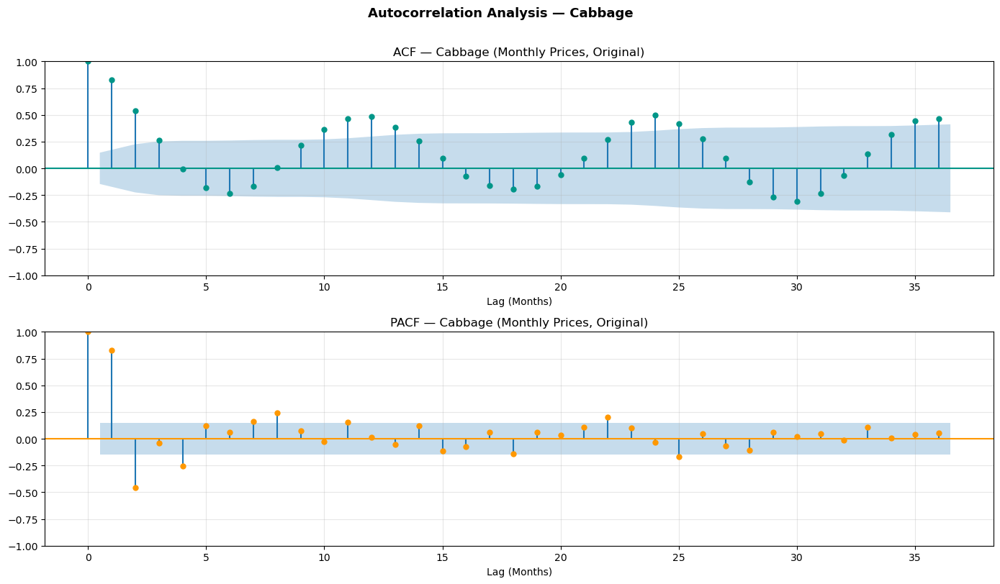
      <br/><sub><b>ACF / PACF — Cabbage (Original)</b></sub>
    </td>
    <td width="50%" align="center">
      
      <br/><sub><b>ACF / PACF — Cabbage (Differenced)</b></sub>
    </td>
  </tr>
</table>

---

### Phase 2 — Forecasting & Model Evaluation

**Feature Engineering:**
- Lag features at lags 1, 2, 3, 6, and 12 — capturing autocorrelation structure
- Rolling statistics: 7-day and 30-day mean / std
- Calendar encodings: month, quarter, year, day-of-week

**Model Hierarchy (complexity-ordered):**

| Tier | Models |
|------|--------|
| Baseline | Naive (last value), Seasonal Naive |
| Statistical | ARIMA (auto-order), Holt-Winters Exponential Smoothing |
| Machine Learning | Linear Regression, Random Forest, XGBoost |
| Tuned ML | RF Tuned (grid search), XGB Tuned (grid search) |

- **Recursive multi-horizon forecasting**: 1-month, 3-month, and 6-month horizons
- **Hyperparameter tuning** via grid search on a chronological validation set — strictly no data leakage
- **Global vs. Local XGBoost** comparison: scalability vs. per-crop accuracy trade-off
- **Evaluation metrics**: MAE · RMSE · MAPE

**Baseline Models:**

<p align="center">
  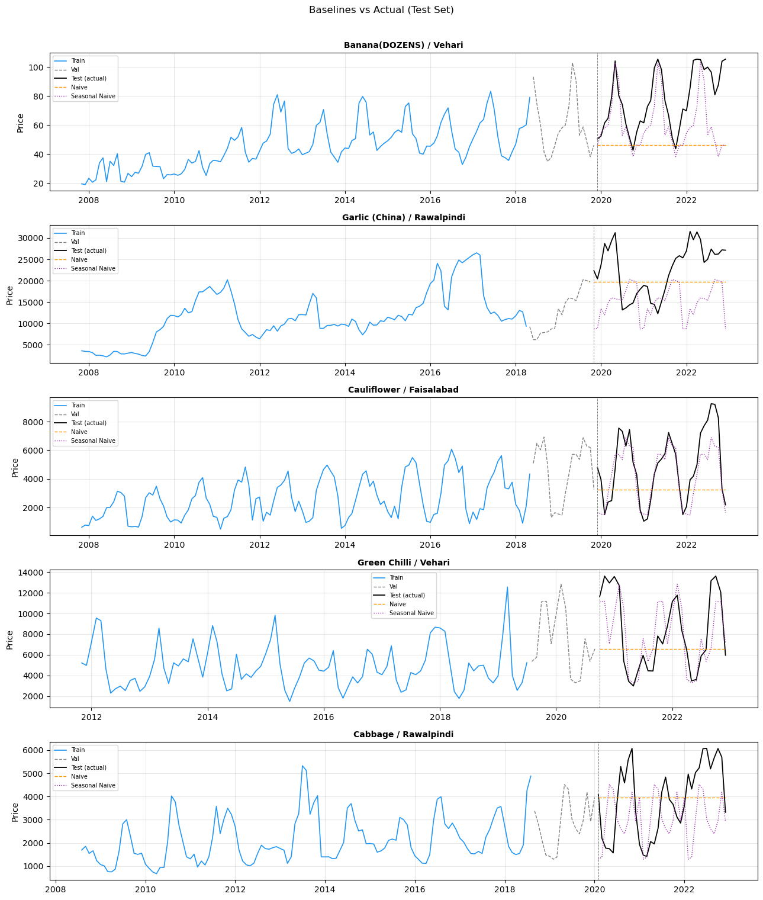
  <br/><sub><b>Naive & Seasonal Naive Baseline Forecasts</b></sub>
</p>

**Statistical Models:**

<p align="center">
  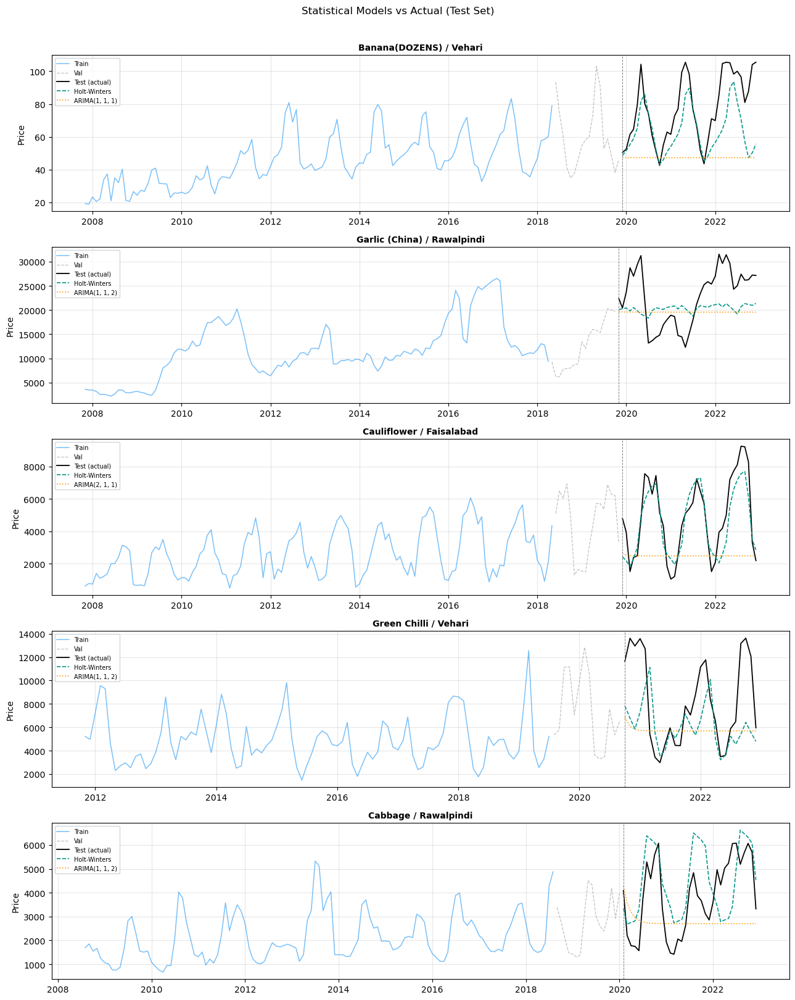
  <br/><sub><b>ARIMA & Holt-Winters Forecasts</b></sub>
</p>

**ML Model — Actual vs. Predicted:**

<p align="center">
  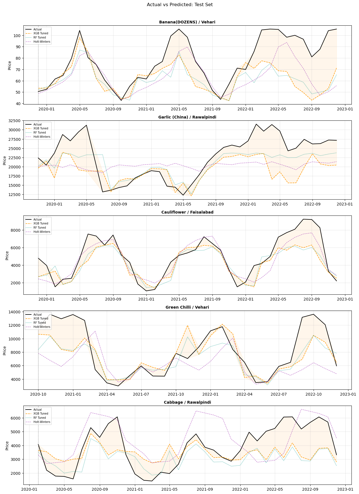
  <br/><sub><b>Actual vs. Predicted — ML Models</b></sub>
</p>

<table width="100%">
  <tr>
    <td width="50%" align="center">
      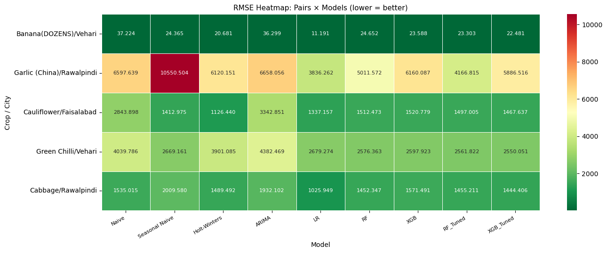
      <br/><sub><b>RMSE Heatmap — All Models × Crops</b></sub>
    </td>
    <td width="50%" align="center">
      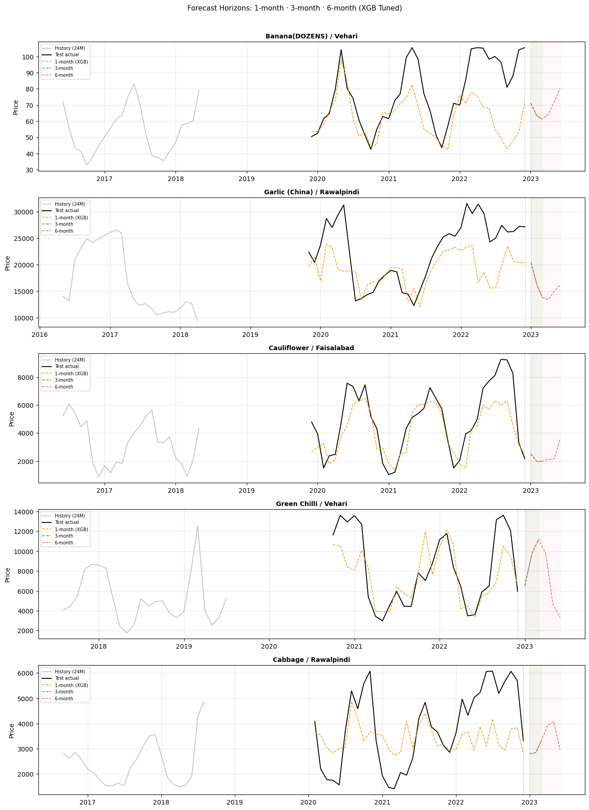
      <br/><sub><b>Forecast Horizon Comparison (1 / 3 / 6 months)</b></sub>
    </td>
  </tr>
  <tr>
    <td width="50%" align="center">
      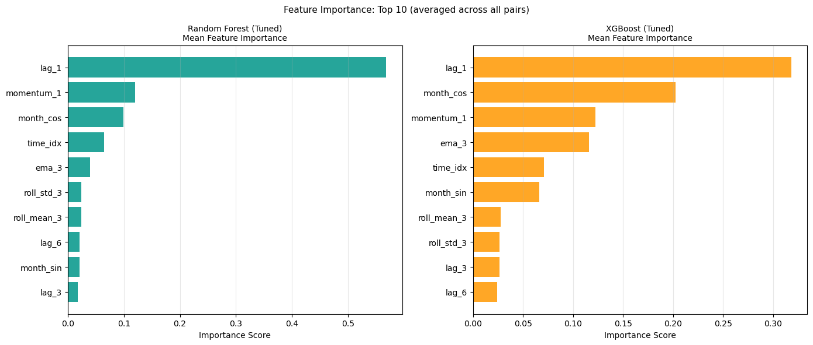
      <br/><sub><b>Feature Importance — Random Forest</b></sub>
    </td>
    <td width="50%" align="center">
      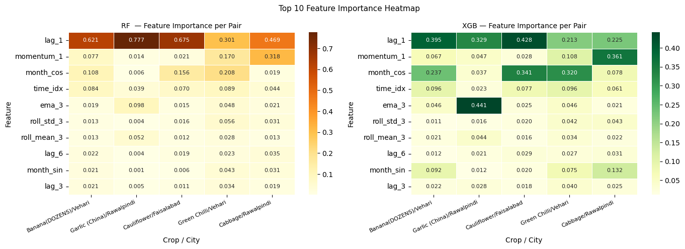
      <br/><sub><b>Feature Importance Heatmap — XGBoost</b></sub>
    </td>
  </tr>
  <tr>
    <td width="50%" align="center">
      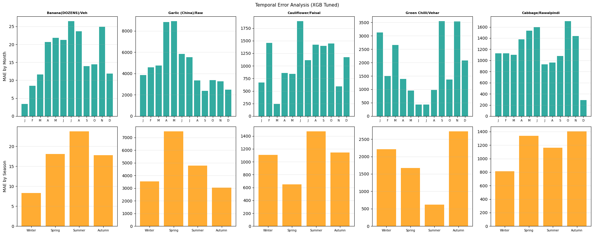
      <br/><sub><b>Temporal Error Distribution</b></sub>
    </td>
    <td width="50%" align="center">
      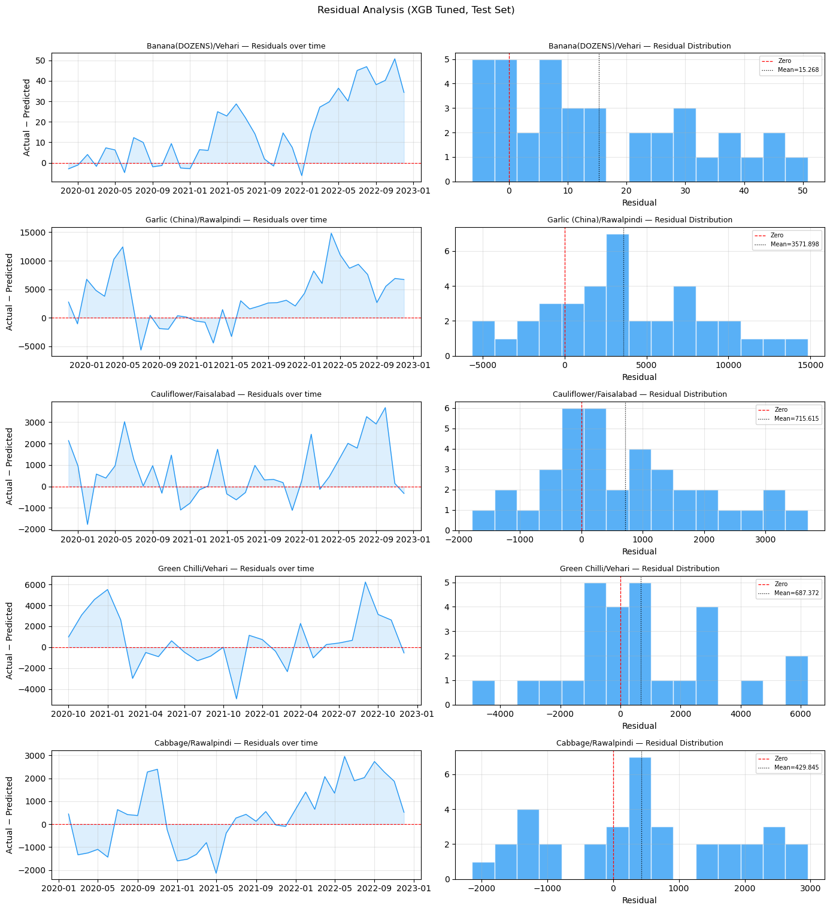
      <br/><sub><b>Residual Analysis</b></sub>
    </td>
  </tr>
</table>

**Per Crop-City — Actual vs. Predicted:**

<table width="100%">
  <tr>
    <td width="50%" align="center">
      
      <br/><sub><b>Banana — Vehari</b></sub>
    </td>
    <td width="50%" align="center">
      
      <br/><sub><b>Garlic (China) — Rawalpindi</b></sub>
    </td>
  </tr>
  <tr>
    <td width="50%" align="center">
      
      <br/><sub><b>Cauliflower — Faisalabad</b></sub>
    </td>
    <td width="50%" align="center">
      
      <br/><sub><b>Green Chilli — Vehari</b></sub>
    </td>
  </tr>
  <tr>
    <td width="50%" align="center">
      
      <br/><sub><b>Cabbage — Rawalpindi</b></sub>
    </td>
    <td width="50%" align="center">
      
      <br/><sub><b>Final Model Ranking</b></sub>
    </td>
  </tr>
</table>

---

### Phase 3 — Clustering & Anomaly Detection

**Feature Engineering per `(Crop, City)` pair:**
- Mean price, standard deviation, OLS trend slope
- Coefficient of variation, seasonality spread, rolling volatility

**Clustering:**
- **K-Means**: Elbow method + Silhouette analysis for optimal K selection
- **Hierarchical / Agglomerative**: Dendrogram-based structural comparison
- **PCA 2D projection** for cluster visualization

**Anomaly Detection (three-method ensemble):** Z-Score · Rolling Deviation · IQR-based flagging

**Integration Analysis:** Cluster type vs. model RMSE correlation; anomaly rate vs. prediction error relationship

<p align="center">
  
  <br/><sub><b>Elbow Curve & Silhouette Analysis — Optimal K Selection</b></sub>
</p>

<table width="100%">
  <tr>
    <td width="50%" align="center">
      
      <br/><sub><b>PCA 2D Cluster Projection</b></sub>
    </td>
    <td width="50%" align="center">
      
      <br/><sub><b>Cluster Feature Profiles</b></sub>
    </td>
  </tr>
  <tr>
    <td width="50%" align="center">
      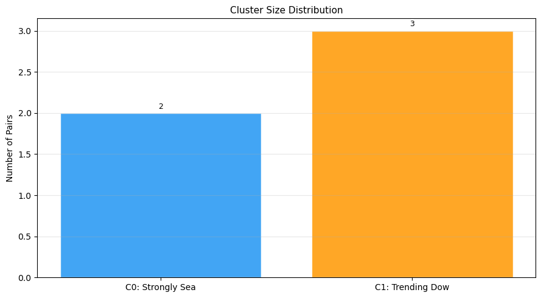
      <br/><sub><b>Cluster Size Distribution</b></sub>
    </td>
    <td width="50%" align="center">
      
      <br/><sub><b>Hierarchical Clustering Dendrogram</b></sub>
    </td>
  </tr>
</table>

<p align="center">
  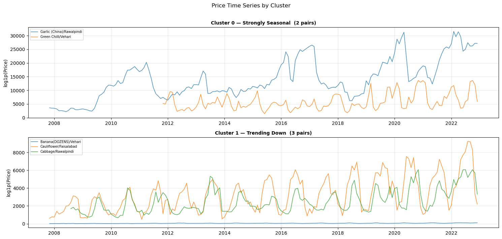
  <br/><sub><b>Price Time-Series by Cluster Group</b></sub>
</p>

<table width="100%">
  <tr>
    <td width="50%" align="center">
      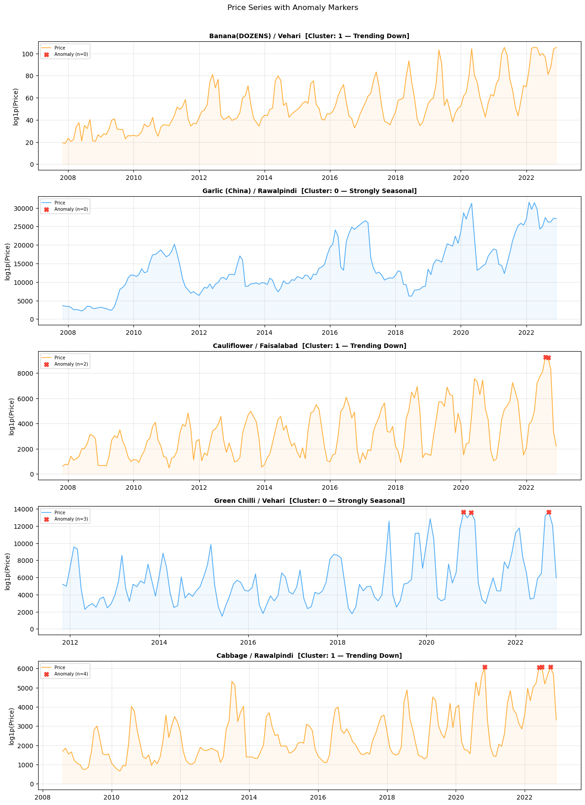
      <br/><sub><b>Anomaly Detection — Time Series View</b></sub>
    </td>
    <td width="50%" align="center">
      
      <br/><sub><b>Anomaly Frequency by Crop</b></sub>
    </td>
  </tr>
  <tr>
    <td width="50%" align="center">
      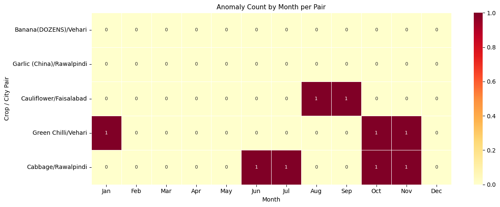
      <br/><sub><b>Monthly Price Heatmap by Cluster</b></sub>
    </td>
    <td width="50%" align="center">
      
      <br/><sub><b>Cluster Type vs. Model RMSE Integration</b></sub>
    </td>
  </tr>
</table>

<p align="center">
  
  <br/><sub><b>Clustering & Anomaly Detection — Final Summary</b></sub>
</p>

---

## 📈 Results & Key Findings

### Model Performance Summary

> Metrics averaged across all 5 evaluated crop-city pairs. MAPE is used as the primary ranking metric as it is scale-independent across crops with vastly different price magnitudes.

| Model | Avg MAPE (%) | Rank |
|-------|:-----------:|:----:|
| **Linear Regression** | **19.69** | 🥇 1st |
| **RF Tuned** | **23.37** | 🥈 2nd |
| Random Forest | 24.52 | 3rd |
| XGB Tuned | 24.61 | 4th |
| XGBoost | 25.05 | 5th |
| Holt-Winters | 28.10 | 6th |
| Seasonal Naive | 31.10 | 7th |
| ARIMA | 39.06 | 8th |
| Naive | 41.35 | 9th |

> **Notable finding:** Linear Regression outperformed all ensemble and statistical models on average MAPE. This is consistent with the dataset's strong, persistent inflationary trend — a well-fitted linear model on time-based features captures most variance before seasonality and lag features handle residual structure.

---

### Per Crop-City Detailed Breakdown

<details>
<summary><b>🍌 Banana (DOZENS) — Vehari</b></summary>

| Model | MAE | RMSE | MAPE (%) |
|-------|----:|-----:|---------:|
| Naive | 31.59 | 37.22 | 36.52 |
| Seasonal Naive | 17.69 | 24.36 | 20.98 |
| Holt-Winters | 15.11 | 20.68 | 17.26 |
| ARIMA (1,1,1) | 30.59 | 36.30 | 35.24 |
| **Linear Regression** | **8.95** | **11.19** | **11.30** |
| Random Forest | 19.13 | 24.65 | 21.70 |
| XGBoost | 17.98 | 23.59 | 20.31 |
| RF Tuned | 17.82 | 23.30 | 20.15 |
| XGB Tuned | 16.74 | 22.48 | 19.01 |

</details>

<details>
<summary><b>🧄 Garlic (China) — Rawalpindi</b></summary>

| Model | MAE | RMSE | MAPE (%) |
|-------|----:|-----:|---------:|
| Naive | 5,863.28 | 6,597.64 | 26.05 |
| Seasonal Naive | 8,979.62 | 10,550.50 | 37.11 |
| Holt-Winters | 5,442.06 | 6,120.15 | 24.76 |
| ARIMA (1,1,2) | 5,899.37 | 6,658.06 | 26.05 |
| **Linear Regression** | **2,646.38** | **3,836.26** | **13.90** |
| Random Forest | 4,059.49 | 5,011.57 | 17.34 |
| XGBoost | 4,703.90 | 6,160.09 | 19.47 |
| RF Tuned | 3,332.46 | 4,166.82 | 14.69 |
| XGB Tuned | 4,636.32 | 5,886.52 | 19.17 |

</details>

<details>
<summary><b>🥦 Cauliflower — Faisalabad</b></summary>

| Model | MAE | RMSE | MAPE (%) |
|-------|----:|-----:|---------:|
| Naive | 2,349.11 | 2,843.90 | 53.72 |
| Seasonal Naive | 1,075.21 | 1,412.97 | 22.74 |
| Holt-Winters | 922.08 | 1,126.44 | 24.18 |
| ARIMA (2,1,1) | 2,704.83 | 3,342.85 | 51.82 |
| **Linear Regression** | **1,026.45** | **1,337.16** | **22.84** |
| Random Forest | 1,183.91 | 1,512.47 | 29.42 |
| XGBoost | 1,127.93 | 1,520.78 | 27.28 |
| RF Tuned | 1,147.99 | 1,497.00 | 27.65 |
| XGB Tuned | 1,093.57 | 1,467.64 | 25.81 |

</details>

<details>
<summary><b>🌶️ Green Chilli — Vehari</b></summary>

| Model | MAE | RMSE | MAPE (%) |
|-------|----:|-----:|---------:|
| Naive | 3,283.60 | 4,039.79 | 41.80 |
| Seasonal Naive | 2,027.16 | 2,669.16 | 25.43 |
| Holt-Winters | 2,958.64 | 3,901.09 | 32.00 |
| ARIMA (1,1,2) | 3,423.46 | 4,382.47 | 38.84 |
| Linear Regression | 2,137.95 | 2,679.27 | 28.47 |
| Random Forest | 2,091.36 | 2,576.36 | 23.89 |
| XGBoost | 1,982.59 | 2,597.92 | 23.61 |
| RF Tuned | 2,092.24 | 2,561.82 | 24.04 |
| **XGB Tuned** | **1,888.07** | **2,550.05** | **22.48** |

</details>

<details>
<summary><b>🥬 Cabbage — Rawalpindi</b></summary>

| Model | MAE | RMSE | MAPE (%) |
|-------|----:|-----:|---------:|
| Naive | 1,334.40 | 1,535.01 | 48.65 |
| Seasonal Naive | 1,722.03 | 2,009.58 | 49.26 |
| Holt-Winters | 1,308.88 | 1,489.49 | 42.29 |
| ARIMA (1,1,2) | 1,644.30 | 1,932.10 | 43.36 |
| **Linear Regression** | **846.74** | **1,025.95** | **21.93** |
| Random Forest | 1,171.81 | 1,452.35 | 30.26 |
| XGBoost | 1,289.90 | 1,571.49 | 34.56 |
| RF Tuned | 1,174.59 | 1,455.21 | 30.30 |
| XGB Tuned | 1,189.61 | 1,444.41 | 36.60 |

</details>

---

### Clustering Summary

| Metric | Value |
|--------|-------|
| Optimal K (K-Means) | — |
| Silhouette Score | — |
| Anomaly Rate (Z-Score) | — |

> 📝 Update from your Phase 3 clustering output files.

---

### Key Analytical Insights

- **Linear Regression wins 4 of 5 crop-city pairs** — reflecting a persistent, trend-driven price structure where inflationary momentum explains most variance before lag and seasonal features refine the residuals
- **ARIMA underperforms significantly** (avg MAPE 39.06%) — likely because the high volatility and non-stationarity of perishable crop prices makes order selection brittle; ADF tests required first-differencing across all series
- **Holt-Winters (28.10% avg MAPE)** is the strongest pure statistical model, outperforming ARIMA by ~11 percentage points on average
- **Green Chilli (Vehari)** is the only series where tree-based models outperform Linear Regression — XGB Tuned achieves MAPE 22.48%, consistent with its higher volatility and non-linear spike behaviour
- **Seasonality at lag ≈ 12 months** confirmed via ACF/PACF across most crop-city pairs
- **Global XGBoost** offers competitive RMSE at significantly reduced training time vs. per-crop local models — a practical advantage for production-scale deployment
- **Winsorization** proved more effective than row-dropping for preserving temporal continuity in chronological forecasting splits

---

## ▶️ How to Run

### 1. Clone the Repository

```bash
git clone https://github.com/whozahm3d/Time-Series-Data-Analysis-and-Trend-Discovery-in-Pakistan-Crop-Prices.git
cd Time-Series-Data-Analysis-and-Trend-Discovery-in-Pakistan-Crop-Prices
```

### 2. Install Dependencies

```bash
pip install -r requirements.txt
```

Or manually:

```bash
pip install numpy pandas matplotlib seaborn scikit-learn xgboost statsmodels scipy psutil
```

### 3. Download the Dataset

1. Go to [Kaggle — Crop Prices Dataset of Pakistan](https://www.kaggle.com/datasets/humairarana/crop-prices-dataset-of-pakistan)
2. Download and extract all **53 CSV files** into a single folder on your machine

### 4. Configure Paths

Open `notebooks/DM_Project_Final_Deliverable.ipynb` and update **Cell 4** (Configuration):

```python
DATA_DIR    = r"path\to\your\csv_folder"
MERGED_FILE = r"path\to\save\merged_output.csv"   # optional
```

### 5. Run the Notebook

```
Kernel → Restart & Run All
```

> ⚠️ **Important:** Cells must be executed sequentially. Each phase depends on variables set in the previous one — do not skip any section.

All output figures and CSV results are saved automatically to `results/`.

---

## 📄 Reports

| Report | Description |
|--------|-------------|
| [Project Proposal](reports/Data%20Mining%20Project%20Proposal.pdf) | Initial scope, objectives, and methodology plan |
| [Mid-Semester Progress Report](reports/DM_mid_semester_progress_report.pdf) | Phase 1 findings and preliminary EDA results |
| [Final Report](reports/DM_Final_Report.pdf) | Complete methodology, results, and conclusions |

---

## 🧠 Engineering Notes

- **Memory-conscious design:** `dtype` optimization and `gc.collect()` calls throughout to handle the large merged dataset (~7.99M rows) without OOM errors
- **No data leakage:** all train / val / test splits are strictly chronological — no shuffling at any pipeline stage
- **Outlier strategy:** Winsorization (IQR capping) preferred over row removal to preserve time-series continuity in chronological forecasting splits
- **Figure export:** all plots saved at 100 DPI via a unified `save_and_show()` helper; increase `dpi` parameter for high-resolution export
- **Stationarity enforcement:** first-differencing applied before ARIMA fitting, confirmed via ADF test at α = 0.05

---

## 👥 Team

| Name | Roll Number |
|------|-------------|
| Ali Ahmad | 23L-2619 |
| Taha Nawaz | 23L-2644 |
| Shahzeb Imran | 23L-2506 |

**FAST NUCES, Lahore · BS Data Science · Semester 6**
**Course: Data Mining (Spring 2026)**

---

## 📜 License

This project is licensed under the [MIT License](LICENSE).
